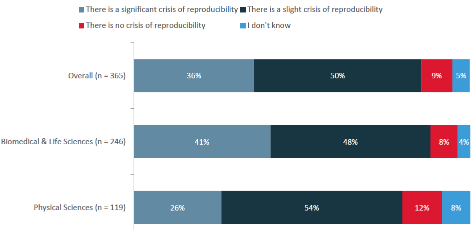
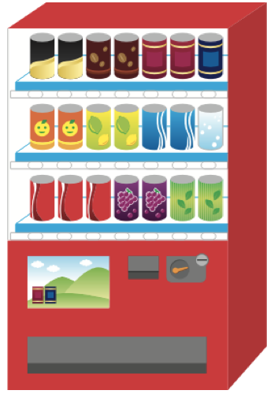
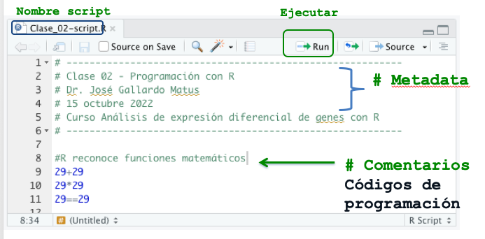
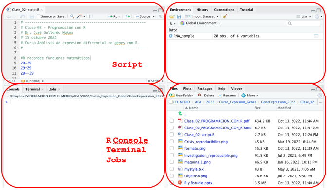
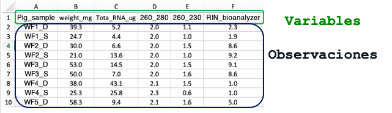

```{r setup, include=FALSE, comment=TRUE}
knitr::opts_chunk$set(echo = FALSE)
```

## **PLAN DE CLASE**

1. **Introducción**


- ¿Qué es R y Rstudio?

- ¿Por qué usar R para el análisis de expresión de genes?

- ¿Qué es la investigación reproducible?.

- ¿Cómo importar datos a R desde excel?

2. **Práctica con R y Rstudio (cloud)**

- Elaborar un script para el análisis de datos con R.

- Familiarizarse con manipulación de objetos de R.

- Importar datos a R desde excel.


## **¿QUÉ ES R?**

1. **R** es un lenguaje y entorno de programación de código abierto o libre creado por Ross Ihaka y Robert Gentleman en 1993 (University of Auckland) para realizar análisis estadísticos y gráficos.


2. Los usuarios de R tienen la libertad de ejecutar, copiar, distribuir, estudiar, modificar y mejorar el **_software_**.

3. Utilizar **R** supone un ahorro económico para los estudiantes, las instituciones educativas o incluso las empresas que decidan usarlo.


## **¿POR QUÉ USAR "R"?**

1. Aprender a usar **R** te da **_independencia digital_**, te permite **_cooperar con otros_** y **_beneficiarte de la ayuda de otros._**

1. Actualmente existen cerca de **17.000 librerías o apps** disponibles de forma gratuita para trabajar con R en ámbitos tan diferentes como las ciencias sociales, la economía, la astronomía, la ingeniería y por su puesto las biociencias.

3. **R** permite entonces difundir el conocimiento a toda la sociedad y no solo a los que pueden pagar por ella.

## **INVESTIGACIÓN REPRODUCIBLE**

La investigación reproducible nace de la idea de que cualquier investigador pueda **reproducir los resultados de un estudio** al analizar los datos con los que fueron generados.

```{r, echo=FALSE, out.width = '100%' }
knitr::include_graphics("Investigacion_reproducible.png")
```

[Peng. 2011](https://www.science.org/doi/10.1126/science.1213847)

## **CRISIS DE REPRODUCIBILIDAD**

70 % (1103/1,576) de los investigadores declaran que quiseron pero no pudieron reproducir un experimento de otro científico.

```{r, echo=FALSE, out.width = '100%' }

```

[Baker. 2016](https://www.nature.com/articles/533452a)

## **ALGUNOS CRITERIOS DE REPRODUCIBILIDAD**

- Los datos están almacenados en formato abierto (texto).
- **Todo el análisis y manejo de datos se hace mediante código.**
- El código genera las tablas y figuras finales.
- **Los datos brutos están separados de los datos derivados.**
- Existe un **_‘script’_** maestro que ejecuta todos los pasos del análisis ordenadamente.
- **Existe un documento README que explica los objetivos y organización del proyecto.**
- Tanto el reporte, como los datos y código son públicos.

[Sánchez et al. 2016](https://www.revistaecosistemas.net/index.php/ecosistemas/article/view/1178)


## **CONCEPTOS BÁSICOS DE PROGRAMACIÓN**

\columnsbegin
\column{.8\textwidth}

**Metáfora de la maquina expendedora de bebidas**  
\
&nbsp;

1. La máquina tiene una función específica.

2. Los productos son objetos almacenados de forma ordenada.

3. Los objetos tienen características (Nombre, precio, ubicación).

4. Para comprar debo seguir una secuencia de pasos (similar a un programa = códigos en secuencia).

\column{.3\textwidth}
```{r, echo=FALSE, out.width = '90%' }

```

\columnsend

## **¿QUÉ ES UN SCRIPT?**

1. Los scripts son documentos de texto con una secuencia de comandos que permiten ejecutar programas.

2. Estos archivos son iguales a cualquier documentos de texto, pero R puede leer y ejecutar el código que contienen.

3. Los códigos de R están contenidos en librerías o packages o aplicaciones.

4. Algunos script que usaremos en este curso tienen extensión de archivo .R, por ejemplo mi_script.R.

## **EJEMPLO R SCRIPT**

```{r, echo=FALSE, out.width = '100%' }

```

## **R ES UN LENGUAJE ORIENTADO A OBJETOS**

**Tipos de objetos para trabajar con R**

```{r, echo=FALSE, out.width = '100%' }
knitr::include_graphics("ObjetosR.png")
```

## **OBJETO: DATA.FRAME**

**Principales características.**  
\
&nbsp;

- Objeto similar a una tabla de datos.  
- Almacenan texto o números.  
- Primera fila contiene el nombre de las variables.  
- Puedo unir con otro **data.frame**.  
- Puedo aplicar funciones para calcular estadísticos.  
- Pero, no tiene atributos de una matriz, ni de un vector, no es una serie de tiempo.  

## **¿QUÉ ES R STUDIO?**


1. **Rstudio** es el más popular entorno de desarrollo integrado (integrated development environment, IDE) para trabajar con **R**.

2. **Rstudio** es un **_software_** libre y de código abierto creado por **Joseph J. Allaire en 2009** para la ciencia de datos, la investigación científica y la comunicación técnica.

3. Actualmente es mantenido por la Corporación de Beneficio Público **Rstudio PCB**, la que ha creado otros software como Rmarkdown.


## **EJEMPLO RSTUDIO - VERSION CLOUD**

```{r, echo=FALSE, out.width = '100%' }

```

## **IMPORTAR DATOS A R: FORMATO**

1. Prefiera archivos sin formato como **txt, csv o tsv**. Si tiene un excel se recomienda transformarlo, particularmente cuando trabaje con miles de filas o columnas.

2. Ojo con separador de columnas, decimales y valores perdidos.

```{r, echo=FALSE, out.width = '100%', fig.align='center', fig.cap="Formato correcto de archivo excel para que sea importado a R."}

```

## **IMPORTAR DATOS A R: readxl**

```{r, echo=TRUE, out.width = '100%', fig.align='center', warning=FALSE}
library(readxl)
RNA_sample <- read_excel("RNA_sample.xlsx",
  col_types = c("text", "numeric", "numeric",
                "numeric", "numeric", "numeric"))
head(RNA_sample[,1:4])
```


## **PRÁCTICA PROGRAMACIÓN CON R**

**Guía de trabajo programación con R en Rstudio.cloud**.

```{r, echo=FALSE, out.width = '80%' }
knitr::include_graphics("Run.png")
```

## **RESUMEN DE LA CLASE**

* Investigación reproducible.

* Iniciamos un proyecto de análisis de datos con **R**.

* Escribimos un script o código de programación de **R** con **Rstudio cloud**.

* Nos familiarizamos con la manipulación de objetos y datos de R: vector y data.frame.

* Importamos datos de concentración y calidad de ARN desde excel a R.


