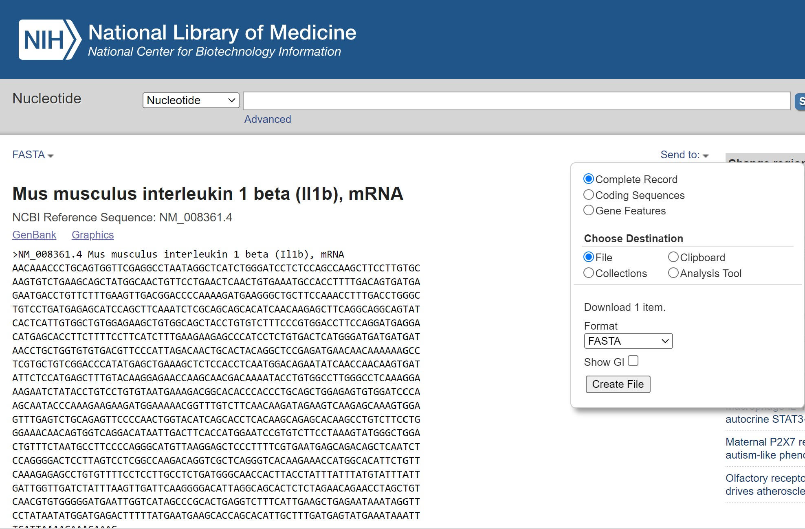
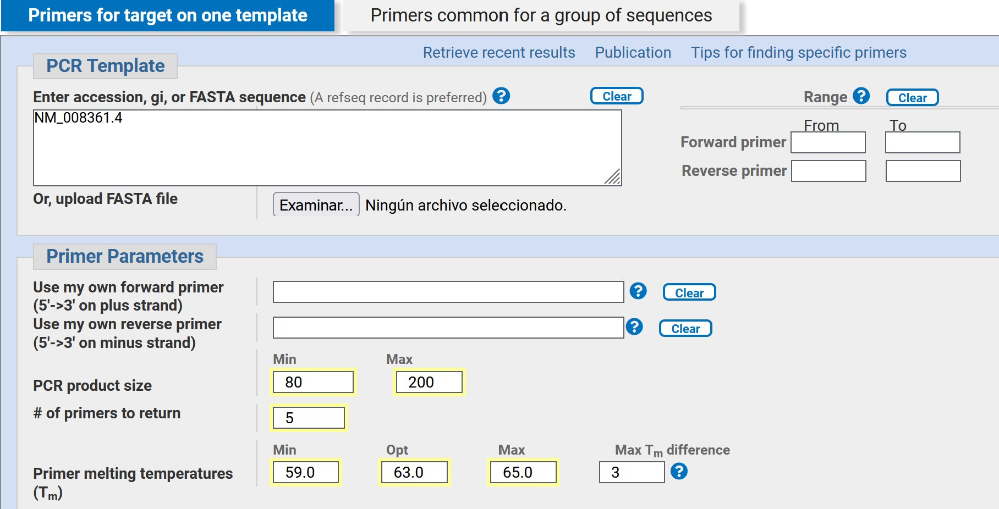
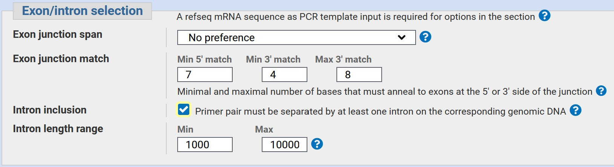
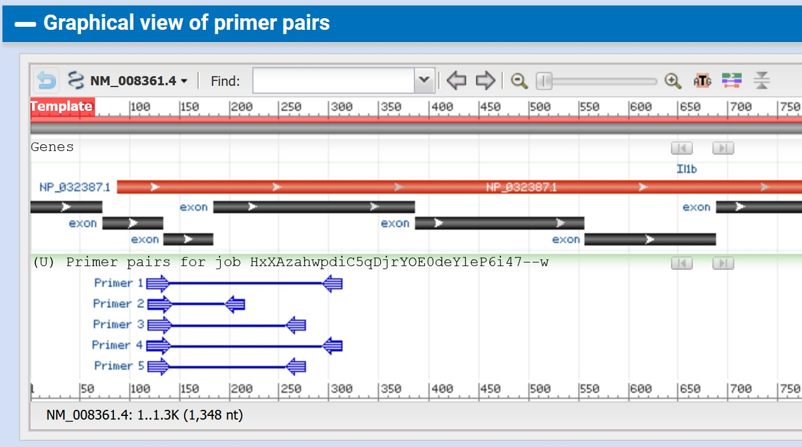
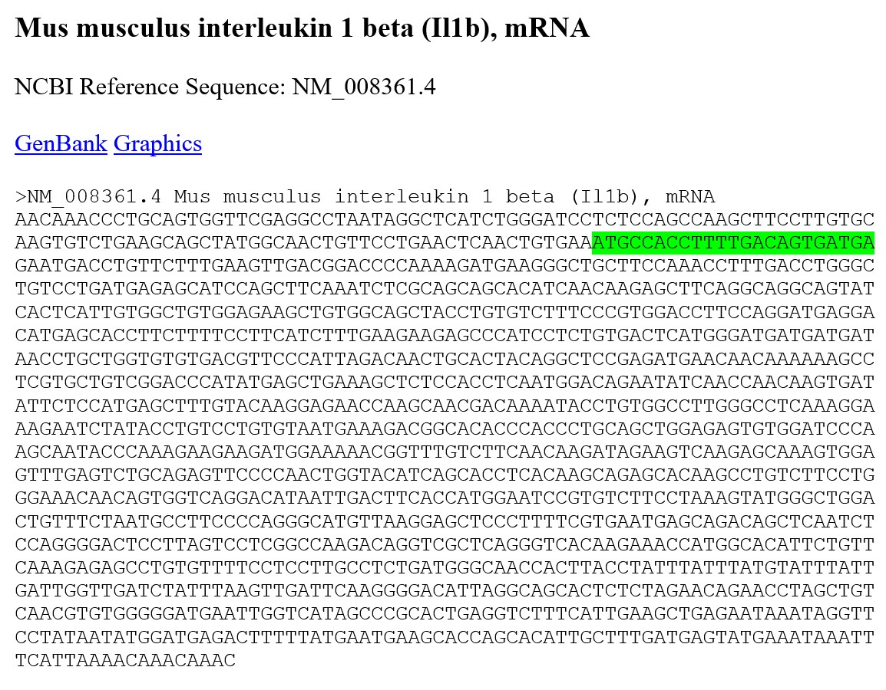
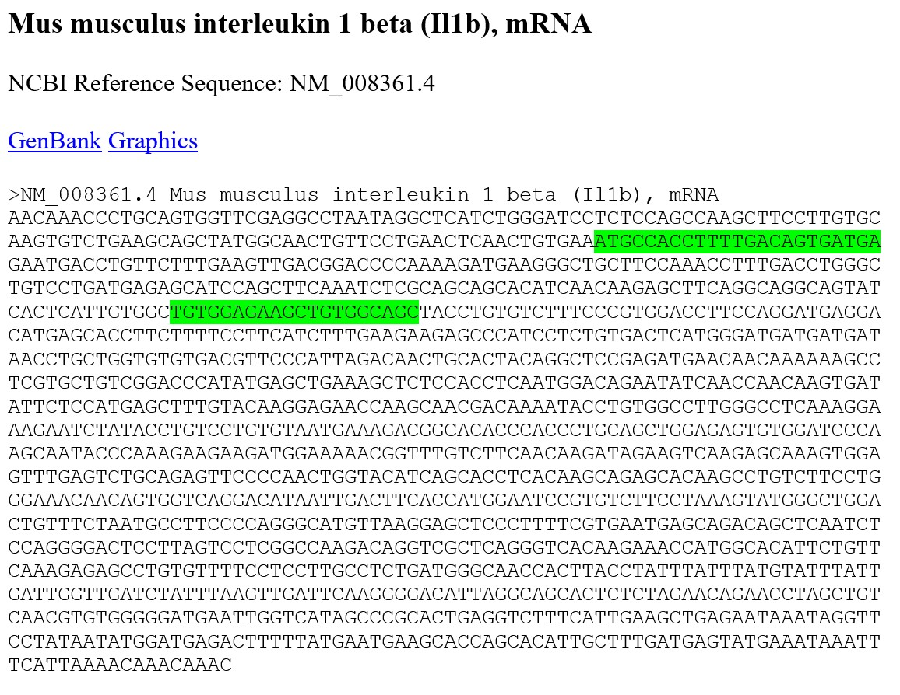
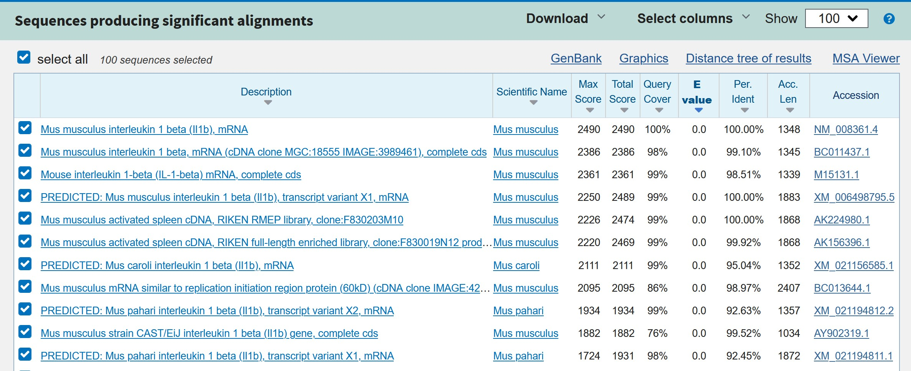

<style>
#TOC {
  color: black;
  font-familiy: Calibri;
  font-size: 14px;
  border-color: #708090; 
}
body {
   color: black;
   font-familiy: Calibri;
}

pre {
  color: black;
  background-color: #F8F8FF;
}
# header {
  color: #800000;
  font-familiy: Calibri;
  background-color: #F5F5F5;
  opacity: 0.8;
  font-size: 16px;
}
</style>

```{r setup, include=FALSE}
knitr::opts_chunk$set(echo = FALSE)
library(kinship2)
library(knitr)
library(pander)
```

### **Introducción**

Un iniciador, cebador o primer es una secuencia corta de ADN de cadena simple que se utiliza en la reacción en cadena de la polimerasa (PCR). En el método PCR se emplea un par de cebadores para hibridar con el ADN de la muestra y definir la región del ADN que será amplificada. También se les conoce como oligonucleótidos (1).

El correcto diseño de cebadores es imprescindible para obtener resultados óptimos tanto en una PCR convencional como en una PCR en tiempo real. Muchas de las consideraciones a tomar en cuenta para el diseño de los cebadores dependen de la aplicación que se le dará. Por ejemplo, el producto de una PCR convencional no está limitada por el tamaño, como en el caso de la PCR en tiempo real. Si se desea clonar una secuencia se elegirá manualmente la ubicación donde se diseñará los cebadores. Si no se conoce la secuencia exacta del gen de interés se pueden diseñar cebadores degenerados, es decir dos secuencias de cebadores que varían en uno o dos nucleótidos.

En el caso de cebadores para PCR en tiempo real deben contar con las siguientes características:

* De 17 a 28 pb de largo, ideal 20 pb
* Tm entre 59 y 65º C, ideal 60º C
* Contenido de GC en un rango de 50 a 60%
* Primers deben terminar en el 3` en G, C, CG o GC
* Evitar tres o más Cs o Gs en el 3`terminal
* Producto PCR de 70 a 200 pb, ideal 150 pb

Además, para optimizar su eficiencia se puede incluir:  

* Contener una abrazadera de GC  
* Evitar repeticiones de nucleótidos  
* Primers separados por un intrón  
* Primers específicos para el gen de interés   
* Si usa Oligo(dT)s durante la transcripción inversa, diseñe los pares de primers para que se unan cerca del 3' del gen.

### **Actividades**

### 1.- Diseñar cebadores desde la plataforma de **NCBI**

1.- Encontrar la secuencia de la citoquina "interleukin 1beta" de *Mus musculus* número de acceso NM_008361.4 en la base de datos de NCBI en la sección de nucleótidos (2).

a) Verificar datos de la secuencia como la longitud y fecha de la última actualización.  

b) Descargar el archivo FASTA como respaldo de la secuencia a utilizar.  


```{r, echo=FALSE, out.width = "600px", fig.align='center', fig.cap='**Figura 1:** Buscador de NCBI para secuencias de Nucleótidos.'}


```

2.- En la sección de análisis de la secuencia ubicado a la derecha de la pantalla seleccionar *Pick primers* para ir a la plataforma de diseño de cebadores.

a) Seleccionar los parámetros para el diseño de sus cebadores:

**Primer parameters**

- *PCR Product size*: seleccionar el tamaño entre los 80 a 200 pares de bases.

- *Number of primers to return*: seleccionar 5 pares de cebadores. 

- *Primer melting temperatures (Tm)*: escoger la temperatura óptima para sus cebadores (Min: 59ºC; Opt: 63ºC; Max: 65ºC).

```{r, echo=FALSE, out.width = "600px", fig.align='center', fig.cap='**Figura 2:** Selección de parametros para obtención de cebadores.'}

```

**Exon/Intron selection**

- Seleccionar *Intron inclusion*

- *Intron length range*: Min: 1000; Max:10000

```{r, echo=FALSE, out.width = "600px", fig.align='center', fig.cap=' **Figura 3:** Selección de parametros para obtención de cebadores.'}

```

b) Generar cebadores seleccionando *Get primers*  

```{r, echo=FALSE, out.width = "600px", fig.align='center', fig.cap=' **Figura 4:** Resultados de la generación de cebadores.'}

```

3.- Responder las siguientes preguntas:

a) ¿Cuantos exones abarcan los cebadores diseñados?

```{r, echo=TRUE}

# Todos los cebadores diseñados abarcan 3 exones cercanos al extremo 5`. 
```

b) ¿Los cebadores *forward* and *reverse* de cada par tienen la misma longitud?

```{r, echo=TRUE}
# Los cebadores Forward tienen diferente longitud, mientras que los Reverse tienen la misma longitud.

# Par 1: Forward: 23 pb; Reverse: 20 pb
# Par 2: Forward: 24 pb; Reverse: 20 pb
# Par 3: Forward: 24 pb; Reverse: 20 pb
# Par 4: Forward: 24 pb; Reverse: 20 pb
# Par 5: Forward: 22 pb; Reverse: 20 pb

```

c) Copie la secuencia FASTA descargada anteriormente en un documento word. Tome las secuencias del primer par de cebadores y encuéntrelos en la secuencia con el buscador de word. ¿Puede encontrar ambos primers? Explique.

```{r, echo=FALSE, out.width = "600px", fig.align='center', fig.cap=' **Figura 5:** Busqueda de cebadores en secuencia Fasta.'}



```


```{r, echo=TRUE}
# Solo se encuentra el cebador Forward que esta en el mismo sentido que la secuencia Fasta (Plus). No se encuentra la secuencia del cebador Reverse ya que este es el reverso complementario de la secuencia Fasta (Minus).
```

d) Tome la secuencia del *Reverse* y generé a través de un traductor de secuencias (3) el reverso complementario. Repita la busqueda del punto C. 

```{r, echo= FALSE, out.width = "600px", fig.align='center', fig.cap=' **Figura 6:** Busqueda de cebadores en secuencia Fasta.'}



```


```{r, echo=TRUE}

# Reverso complementario del cebador Reverse: TGTGGAGAAGCTGTGGCAGC. Esta secuencia esta en el mismo sentido que el Fasta (Plus). 

```

### 2.- Analizar la especificidad de los cebadores en la plataforma **BLAST** de NCBI

1.- Analizar la especificidad de los cebadores en la plataforma **Blast** (4). Pegar la secuencia del forward y analizar. Verificar que se alinea con secuencias de la especie y el gen de interés. Repetir con el primer reverse. ¿Cuantas son las primeras secuencias que corresponden a la especie y gen de los cebadores?


```{r, echo=FALSE, out.width = "600px", fig.align='center', fig.cap=' **Figura 7:** Blast del cebador *Forward* para verificar especificidad del cebador.'}

 

```


```{r, echo=TRUE}

# Las cuatro primeras secuencias corresponden a la especie Mus musculus y el gen interleukin 1 beta, luego disminuye la especificidad apareciendo en la lista otras especies del mismo genero.

```


### **REFERENCIAS**

(1) Glosario hablado de Términos Genéticos (https://www.genome.gov/es/genetics-glossary/Iniciador-o-cebador#:~:text=Un%20iniciador%20o%20cebador%20es,se%20les%20conoce%20como%20oligonucle%C3%B3tidos)

(2) National Center for Biotechnology Information (NCBI) (https://www.ncbi.nlm.nih.gov/nucleotide/)

(3) Bioinformatics
(https://www.bioinformatics.org/sms/rev_comp.html)

(4) Blast de NCBI
(https://blast.ncbi.nlm.nih.gov/Blast.cgi?PROGRAM=blastn&PAGE_TYPE=BlastSearch&LINK_LOC=blasthome)
