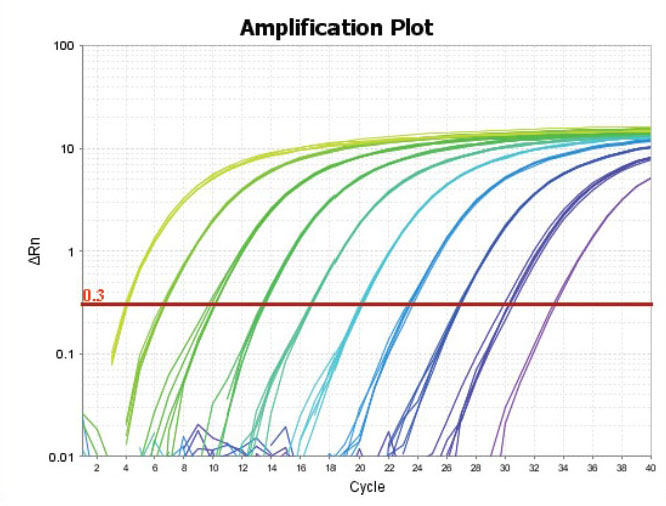
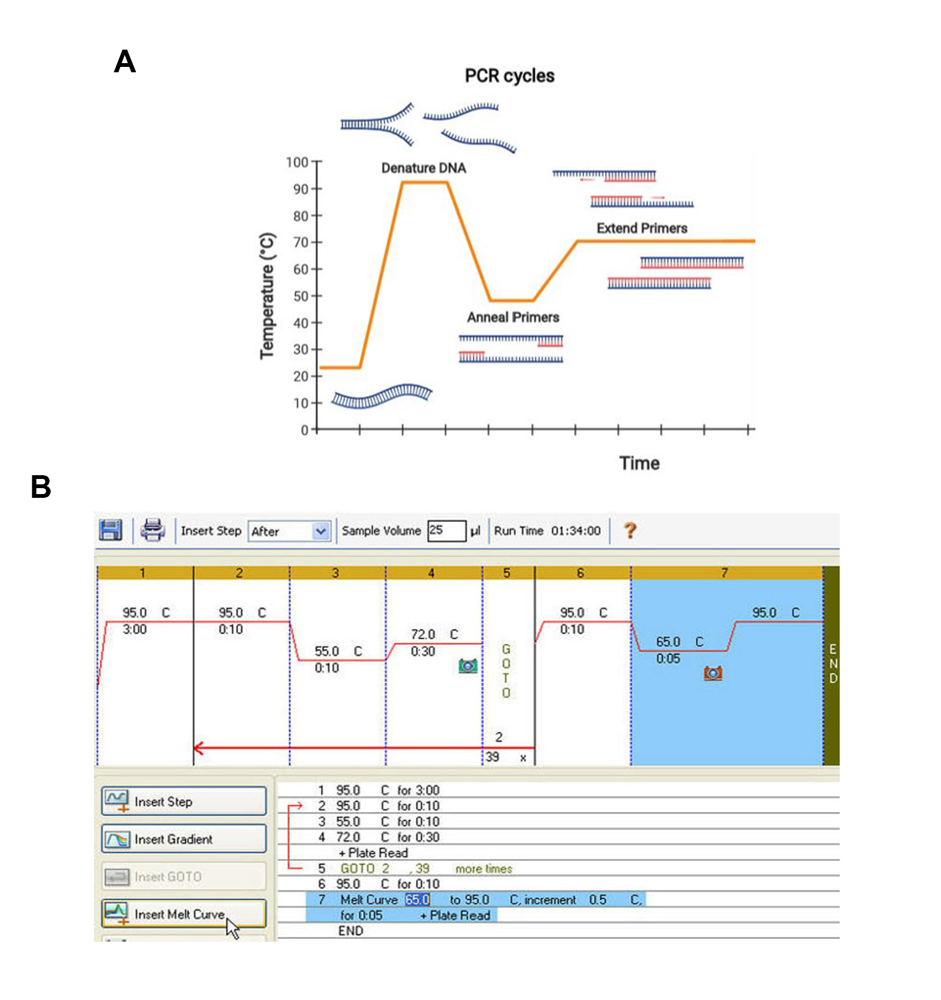
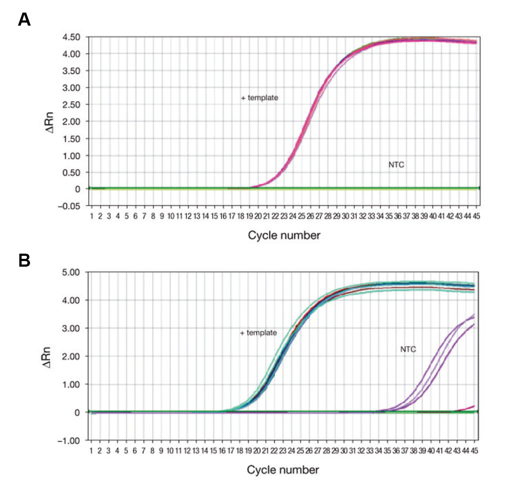
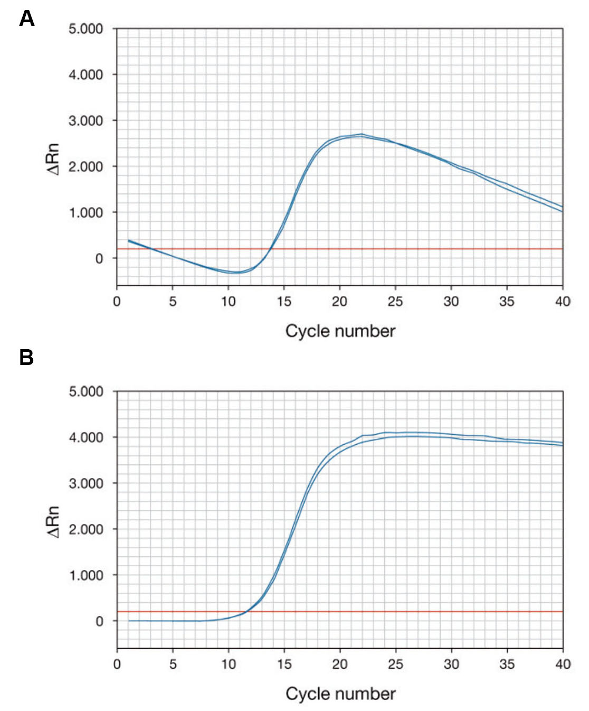
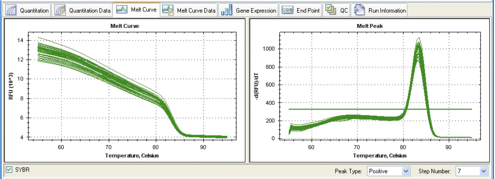

<style>
#TOC {
  color: black;
  font-familiy: Calibri;
  font-size: 14px;
  border-color: #708090; 
}
body {
   color: black;
   font-familiy: Calibri;
}

pre {
  color: black;
  background-color: #F8F8FF;
}
# header {
  color: #800000;
  font-familiy: Calibri;
  background-color: #F5F5F5;
  opacity: 0.8;
  font-size: 16px;
}
</style>

## **Introducción**

La reacción en cadena de la polimerasa (PCR) es una poderosa tecnología en biología molecular. Usando PCR, secuencias específicas dentro de una plantilla ADNc pueden ser copiado, o "amplificado", de miles a un millón de veces utilizando oligonucleótidos específicos de secuencia la ADN polimerasa termoestable y ciclos térmicos.

Ahora revisaremos algunos términos comunes utilizados durante la PCR.

**$\Delta Rn$**

Es el valor normalizado de la señal fluorescente dividida por la señal de fluorescencia basal de cada reacción.

**Línea base (Baseline)**

La línea de base de la reacción de PCR en tiempo real se refiere al nivel de señal durante los ciclos iniciales de PCR, que por lo general abarca los ciclos 3 al 15, en los que hay pocos cambios en la fluorescencia. Este nivel basal de fluorescencia bajo la línea base puede determinarse automáticamente o por el usuario. Debe establecerse cuidadosamente ya que en base a este se realizará el cálculo de Ct (ciclo umbral *Threshold cycle*) (1 y 2).

**Umbral (Threshold)**

El umbral de la reacción de PCR en tiempo real es el nivel de señal que refleja un aumento estadísticamente significativo sobre la señal basal (1 y 2).  

**Ct (Threshold cycle)**

El ciclo umbral (Ct) es el número de ciclos en el que la señal fluorescente de la reacción cruza el umbral. El Ct se utiliza para calcular el número inicial de copias de ADN, porque el valor de Ct está inversamente relacionado con la cantidad inicial de ADN. Por ejemplo, al comparar en tiempo real resultados de PCR de muestras que contienen diferentes cantidades de
objetivo, una muestra con el doble de la cantidad inicial producirá un Ct un ciclo antes que una muestra con el doble del número de copias del objetivo, en relación con una segunda muestra, tener un Ct un ciclo antes que el de la segunda muestra (1 y 2).

**Curva de fusión (Melt curve)**

El análisis de la curva de fusión se revisa que el fluoróforo permanece asociado al amplicón. Este análisis solo se puede realizar en PCR en tiempo real y en aquellas reacciones donde se utilizó colorantes de unión al ADN del tipo SYBR Green. El uso del sistema TaqMan no es compatible con este análisis ya que producen un cambio irreversible en la señal escindiendo y liberando el fluoróforo en solución durante la PCR. Sin embargo, la mayor especificidad
de este método hace que esto no sea necesario (1 y 2).
La curva de fusión se obtiene una imagen que registra el aumento significativo de la fluorescencia del SYBR Green al unirse al dsADN. Al monitorear el dsDNA a medida que se separan las hebras y se vuelve monocatenario por el aumento de la temperatura conlleva a la disminución en fluorescencia al disociarse el colorante del ADN (1 y 2).


```{r, echo=FALSE, out.width = "500px", fig.align='center', fig.cap='**Figura 1:** Gráfico de amplificación de PCR en tiempo real. Fuente: (1).'}


```


## **Actividades**


### 1.- Protocolo termociclador

La PCR en tiempo real cuenta con diferentes etapas que deben ser programadas en el termociclador en base a los reactivos utilizados, las características de la muestra y objetivos del estudio. En base a la Figura 2A nombrar y explicar las etapas del protocolo del termociclador del 1 al 7 de la Figura 2B . 


```{r, echo=FALSE, out.width = "700px", fig.align='center', fig.cap='**Figura 2:** Programa estándar para PCR en tiempo real. Fuente: (3).'}


```


```{r, echo=TRUE}

# 1: Desnaturalización inicial de la doble hebra de ADN.
# 2: Desnaturalización de la doble hebra de ADN.
# 3: Hibridación, unión de los cebadores a la hebra monocatenaria de ADN.
# 4: Extensión del ADN, síntesis de la nueva cadena de ADN.
# 5: GOTO 2, número de ciclos de la PCR en tiempo real en este caso son 40 ciclos, un ciclo abarca del punto 2 al 4. 
# 6: Desnaturalización final del ADN molde.
# 7: Melt curve, 55º C temperatura de alineamiento de los cebadores; 95ºC desnaturalización de la doble hebra de ADN. 

```


### 2.- Gráficos de amplificación

La Figura 3A muestra una gráfica de amplificación de una PCR en tiempo real realizada con SYBR Green como colorante de ADN. La gráfica muestra la amplificación ideal de un gen de interés donde no hay amplificación en los controles negativos (NTC: Not template control). Hay que recordar que los controles negativos contienen SYBR Green master mix, cebadores y agua sin la muestra ADNc. Además, la amplificación muestra curvas muy similares u ajustadas entre sí. En base a esto describa y explique la figura 3B.


```{r, echo=FALSE, out.width = "500px", fig.align='center', fig.cap='**Figura 3:** Gráficos de amplificación de PCR en tiempo real (A) Caso ideal y (B) Caso estudio. Fuente: (1).'}


```


```{r, echo=TRUE}

# En la figura 3B se observa un aumento de la  fluorescencia en los controles negativos (NTC) aunque menor que el de las muestras. Esta menor señal se atribuye a la presencia de dímeros de primers. Además, se observa una curva de amplificación más amplia que en la figura 3A.

```

### 3.- Gráficos de amplificación y línea base

La linealidad de la línea base de la curva de amplificación es un parámetro que pueden afectar los resultados. El termociclador selecciona la línea base automáticamente, pero se recomienda revisar y ajustar manualmente si es necesario. La figura 4 muestra dos curvas de amplificación con diferente configuración. Explique cuál es mejor y porque.


```{r, echo=FALSE, out.width = "450px", fig.align='center', fig.cap='**Figura 4:** Gráficos de amplificación con diferente configuración de la línea base. Fuente: (1).'}


```


```{r, echo=TRUE}

# La figura 4B muestra una mejor configuración de la línea base ya que abarca una fase de la fluorescencia basal que es lineal. Además, esta seleccionada de tal manera que solo sobresalgan de ella los ciclos posteriores al 15, a diferencia de la figura 4A donde la línea base deja sobre ella la fluorescencia que pueda ocurrir en ciclos iniciales de la PCR en tiempo real.

```

### 4.- Curva de fusión o "Melt curve"

La especificidad de un ensayo de PCR en tiempo real está determinada por los cebadores y las condiciones de reacción utilizadas. Sin embargo, existe la posibilidad de que incluso los cebadores bien diseñados pueden formar dímeros de cebadores o amplificar un producto no específico. La especificidad de la reacción de PCR se puede confirmar utilizando el análisis de la curva de fusión o Melt Curve. En la figura 5 se muestra cómo se observa la gráfica de la curva de fusión normalizado y la clásica  curva de fusión derivada.   


```{r, echo=FALSE, out.width = "700px", fig.align='center', fig.cap='**Figura 5:** Gráficas normalizada (izquierda) y derivada (derecha) de la curva de fusión. Fuente: (2).'}


```

## **Análisis de curvas de fusión**

Determinar si pueden usarse y porque los cebadores analizados a través de PCR en tiempo real en los casos 1 al 6 en base a las siguientes figuras:  


**Caso 1.** Análisis set de cebadores 1.

```{r, echo=FALSE, out.width = "300px", fig.align='center', fig.cap='**Figura 6:** Gráfica de curva de fusión Caso 1. Fuente: Propio.'}
knitr::include_graphics("6.jpg")

```


```{r, echo=TRUE}

# No puede usarse este par de cebadores ya que en la curva de fusión se obtienen dos peaks y existe un amplio rango de fluorescencia entre las muestras, lo que indica inespecificidad de los cebadores.

```

**Caso 2.** Análisis set de cebadores 2.

```{r, echo=FALSE, out.width = "300px", fig.align='center', fig.cap='**Figura 6:** Gráfica de curva de fusión Caso 2. Fuente: Propio.'}
knitr::include_graphics("7.jpg")

```


```{r, echo=TRUE}

# Si puede usarse este par de cebadores ya que en la curva de fusión se obtiene un solo peak y la fluorescencia entre las muestras es bastante ajustada lo que indica especificidad de los cebadores.

```

**Caso 3.** Análisis set de cebadores 3.

```{r, echo=FALSE, out.width = "300px", fig.align='center', fig.cap='**Figura 6:** Gráfica de curva de fusión Caso 3. Fuente: Propio.'}
knitr::include_graphics("8.jpg")

```


```{r, echo=TRUE}

# No puede usarse este par de cebadores ya que en la curva de fusión se obtiene un peak con múltiples "shoulders", además, de existir un amplio rango de fluorescencia entre las muestras en el área previo al peak, lo que indica inespecificidad de los cebadores.
```


**Caso 4.** Análisis set de cebadores 4.

```{r, echo=FALSE, out.width = "300px", fig.align='center', fig.cap='**Figura 6:** Gráfica de curva de fusión Caso 4. Fuente: Propio.'}
knitr::include_graphics("9.jpg")

```


```{r, echo=TRUE}

# Si puede usarse este par de cebadores ya que en la curva de fusión se obtiene un solo peak y la fluorescencia entre las muestras es bastante ajustada lo que indica especificidad de los cebadores.
```

**Caso 5.** Análisis set de cebadores 5.

```{r, echo=FALSE, out.width = "300px", fig.align='center', fig.cap='**Figura 6:** Gráfica de curva de fusión Caso 5. Fuente: Propio.'}
knitr::include_graphics("10.jpg")

```


```{r, echo=TRUE}

# No puede usarse este par de cebadores ya que en la curva de fusión se obtienen dos peaks, los peaks son gruesos y hay presencia de "shoulders" y existe un amplio rango de fluorescencia entre las muestras, lo que indica inespecificidad de los cebadores.

```


### **REFERENCIAS**

(1) Real-time PCR handbook. Applied Biosystems. Life technologies. 2014.  (https://www.thermofisher.com/content/dam/LifeTech/global/Forms/PDF/real-time-pcr-handbook.pdf)

(2) Real-time PCR Applications Guide. Bio-RAD. 2006.
(https://www.bio-rad.com/webroot/web/pdf/lsr/literature/Bulletin_5279.pdf)

(3) Sistema de detección CFX96™ mediante PCR en tiempo real. Manual de instrucciones. 2010.
(https://www.altona-diagnostics.com/files/public/Content%20Homepage/-%2003%20Biorad%20CFX96/Biorad%20CFX96%20Manuals%20und%20Co/CFX96_IM_Spanish_ES_RevA.pdf)
