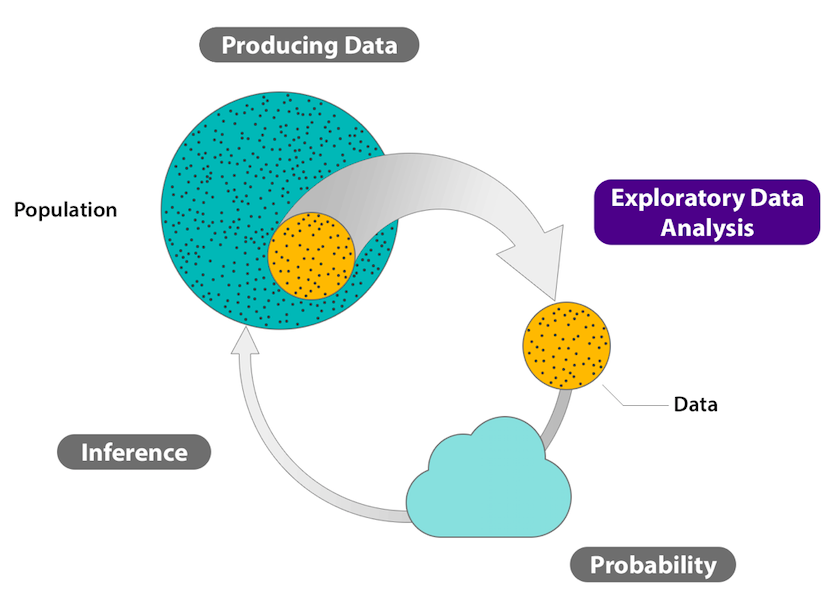
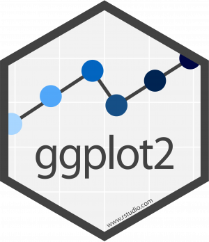
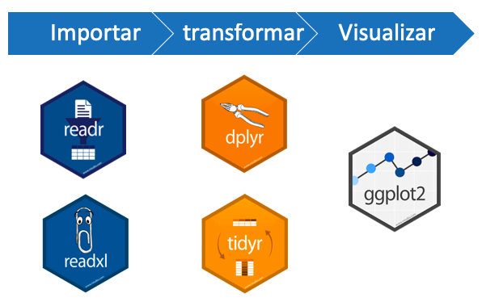
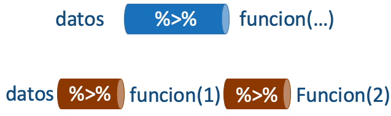
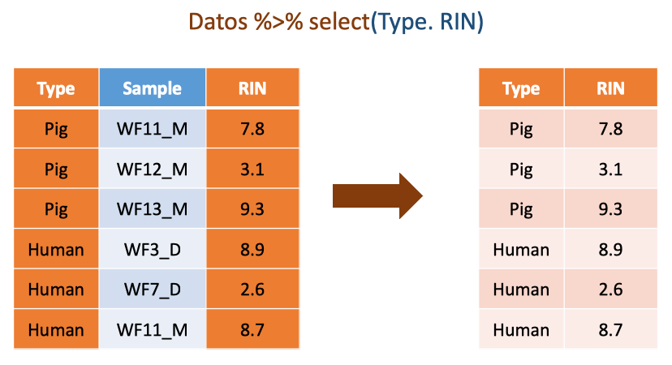
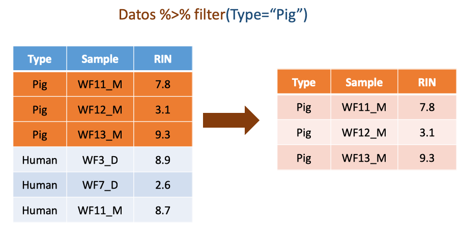
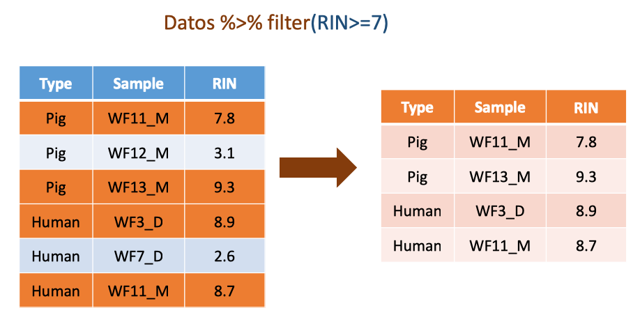
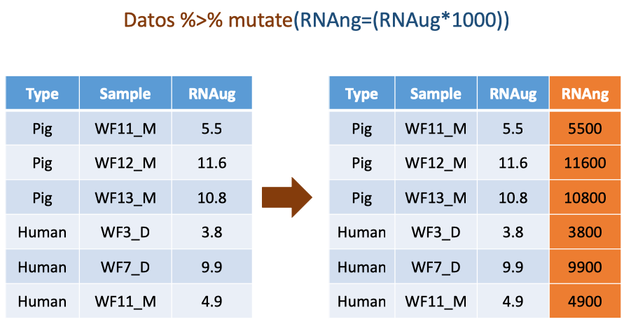
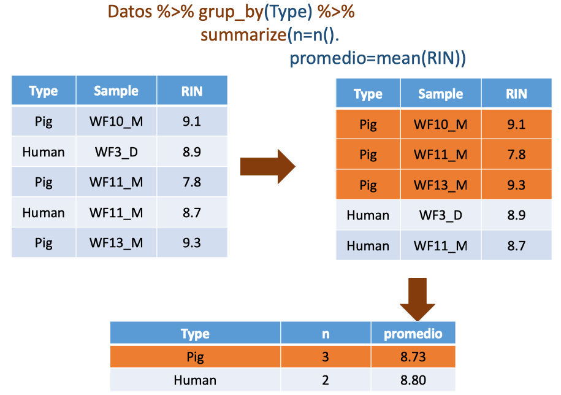

```{r setup, include=FALSE}
knitr::opts_chunk$set(echo = FALSE)
library(MASS)
library(psych)
library(ggplot2)
library(pander)
library(dplyr)
require(gridExtra)
library(grid)
library(readxl)
```

# PLAN DE LA CLASE
**1.- Introducción**
    
- ¿Qué es un análisis exploratorio de datos?.
- Gráficas avanzadas con ggplot2.
- Manipular datos con tidyr: Tuberias.
- Manipular datos con dplyr: filtrar, seleccionar, eliminar muestras.

**2.- Práctica con R y Rstudio cloud**

- Realizar un análisis exploratorio de datos de ARN.
- Realizar gráficas avanzadas con ggplot2.
- Manipular de datos con tidyr y dplyr.

# ANÁLISIS EXPLORATORIO DE DATOS (EDA)

**¿Qué es un análisis exploratorio de datos?**  
Procedimiento que permite visualizar y explorar las variables/datos de un estudio.  

```{r, echo=FALSE, out.width = '70%' , fig.align='center'}

```

# ¿POR QUÉ ES NECESARIO HACER UN EDA?

**Principalmente para:**  

1. Investigar calidad de los datos brutos (ARN).  

2. Eliminar muestras de baja calidad de (ARN).  

3. Observar variación de los datos (expresión de genes).  

4. Establecer un modelo básico de relación e interacción entre variables (expresión de genes).  

5. Seleccionar una prueba estadística adecuada (expresión de genes).  

# EDA ES UN PROCESO ITERATIVO

**¿Cómo realizar un buen EDA?**

1. Genera preguntas iniciales para explorar tus datos.

2. Resume, visualiza, transforma y modela tus datos.

3. Usa lo que aprendiste para generar nuevas preguntas.

**Preguntas clave, pero no las únicas**  

- ¿Existen errores, datos faltantes, muestras de baja calidad?

- ¿Qué tipo de variación existe en la/s variables de estudio?  

- ¿Qué tipo de covariación o interacción existe entre las variables de estudio?  

- ¿Cuál es el modelo más simple que explica la relación entre variables?

# GRÁFICAS CON GGPLOT2
\columnsbegin
\column{.8\textwidth}
**ggplot2**  
Paquete de visualización de datos preferido para realizar análisis exploratorio de datos con R [Wickham en 2005](https://ggplot2.tidyverse.org/)).

**Ventajas**  
- Gran flexibilidad.  
- Sistema para realizar gráficos completo y maduro.  
- Una gran comunidad de desarrolladores.  

**Características**  
- Los datos siempre deben ser un data.frame.  
- Usa un sistema diferente para añadir elementos al gráfico.  

\column{.2\textwidth}
```{r, echo=FALSE, out.width = '80%' }

```
\columnsend

# COMPARACIÓN GGPLOT2 - GRAPHICS

Comparación de algunos comandos de gráficas entre los paquetes **graphics** y **ggplot2**

| **Función**  |  **graphics** |  **ggplot2** |
|:---:|:---:|:---:|
|Función genérica para graficar |plot() |ggplot()|
|Histogramas |hist() |geom_histogram()|
|Gráfica de cajas y bigotes |boxplot()  |geom_boxplot()|
|Etiquetar ejes |xlab="" , ylab=""|labs(x="",y="")|

# RECORDAR FORMATO CORRECTO DE DATOS

**Tidy data (datos ordenados)**  

- Cada columna es una variable.  
- Cada fila es una observación.  
- Cada celda es un simple dato o valor.  

**Messy data (desordenados)**  

- Cualquier conjunto de datos que no cumple alguno de estos criterios.  

# EJEMPLO DATOS ORDENADOS

```{r}

# Importa base de datos en formato .xlsx
RNA_sample <- read_excel("RNA_sample.xlsx",
                        col_types = c("text","text", "numeric", "numeric",
                        "numeric", "numeric", "numeric"))
head(RNA_sample[,1:6])
```


# ¿CÓMO FUNCIONA GGPLOT2?

**ggplot2 funciona por capas**


```{r, echo=TRUE, out.width = '80%', fig.align='center'}
ggplot(RNA_sample, aes(RNA_ug))
```

# HISTOGRAMAS CON GGPLOT2

```{r, echo=TRUE, out.width = '80%', message=FALSE, fig.align='center'}
ggplot(RNA_sample, aes(RNA_ug)) +
  geom_histogram(color="white", fill="blue", bins = 10)
```

# CAMBIAR ETIQUETAS DE EJES

```{r, echo=TRUE, out.width = '70%', message=FALSE, fig.align='center'}
ggplot(RNA_sample, aes(RNA_ug))+
 geom_histogram(color="white", fill="blue", bins = 10)+
  labs(title="Histograma", x="ARN total (ug)", 
       y="Frecuencia")
```

# CAMBIAR TAMAÑO DE ETIQUETAS

```{r, echo=TRUE, out.width = '70%', message=FALSE, fig.align='center'}

My_Theme = theme(
  axis.title.x = element_text(size = 18),
  axis.text.x = element_text(size = 18),
  axis.title.y = element_text(size = 18),
  axis.text.y = element_text(size = 18))

plot_1 <- ggplot(RNA_sample, aes(RNA_ug))+
 geom_histogram(color="white", fill="blue", bins = 10)+
  labs(title="Histograma", x="ARN total (ug)", 
       y="Frecuencia")

```


# HISTOGRAMA FINAL

```{r, echo=TRUE, out.width = '90%', fig.align='center'}
plot_1 + My_Theme
```

# BOXPLOT CON GGPLOT2

```{r, echo=TRUE, out.width = '80%', message=FALSE, fig.align='center'}
ggplot(RNA_sample, aes(x=Type, y= RNA_ug))+
 geom_boxplot(color="blue")+
  labs( x="Tipo de muestra", y="ARN total (ug)") +
  My_Theme
```

# MANIPULACIÓN DE DATOS

## Tareas comunes durante esta etapa:

* Filtrar datos por categorías.  
 
* Remover muestras con baja calidad.  

* Imputar datos faltantes.  

* Agrupar datos por algún criterio.  

* Seleccionar y calcular estadísticos.  

* Generar variables derivadas a partir de variables existentes.   

* Transformar variables.

# PAQUETES CLAVE

```{r, echo=FALSE, out.width = '100%', fig.align='center'}


```

# EL OPERADOR PIPE: %>%.

En programación **pipe** es una técnica que permite pasar información de un proceso o programa a otro por etapas.

Evita pipe cuando:
a) Deseas manipular varios objetos a la vez.
b) Un paso intermedio genera un objeto que luego deseas analizar separadamente.

```{r, echo=FALSE, out.width = '80%', fig.align='center'}


```

# PAQUETE DPLYR: FUNCIONES BÁSICAS

**select()**: Permite extraer o seleccionar variables/columnas específicas de un data.frame.

**filter()**: Para filtrar desde una tabla de datos un subconjunto de filas. Ej. solo un nivel de un factor, observaciones que cumplen algún criterio (ej. > 20).

**mutate()**: Permite calcular/generar nuevas variables "derivadas". Útil para calcular proporciones, tasas.

**group_by()**: Permite agrupar filas con base a los niveles de alguna variable o factor.

**summarize()**: Permite obtener medidas resumen de las variables.

# SELECT()

- Selección de variables.
```{r, echo=FALSE, out.width = '90%', fig.align='center'}


```


# FILTER()

- Filtrar por categorias o factores.
```{r, echo=FALSE, out.width = '90%', fig.align='center'}


```


# FILTER()

- Filtrar por valor numérico.
```{r, echo=FALSE, out.width = '90%', fig.align='center'}


```


# MUTATE()

- Calcula y agrega nuevas variables.
```{r, echo=FALSE, out.width = '90%', fig.align='center'}


```


# GROUP_BY() + SUMMARIZE()

```{r, echo=FALSE, out.width = '90%', fig.align='center'}


```


# RESUMEN DE LA CLASE

1. Realizamos análisis exploratorio de datos.  
        
2. Realizamos gráficas con ggplot2.  

3. Manipulamos datos con tidyr y dplyr.

4. Utilizamos tuberías o pipe **%>%**.

