```{r setup, include=FALSE}
knitr::opts_chunk$set(echo = FALSE)
library(MASS)
library(psych)
library(ggplot2)
library(fishdata)
library(pander)
library(dplyr)
require(gridExtra)
library(grid)
library(readxl)
```

# PLAN DE LA CLASE
**1.- Introducción**
    
- Análisis exploratorio de datos de expresión de genes. 
- Diseño balanceado o desbalanceado.
- Clasificación de variables aleatorias.
- Variabilidad de datos de expresión de genes.
- Correlación de datos de expresión de genes. 
- Funciones avanzadas de Tidyr.  

**2.- Práctica con R y Rstudio cloud**

- Realizar un análisis exploratorio de datos de expresión de genes.
- Realizar gráficas avanzadas con ggplot2. 

# ANÁLISIS EXPLORATORIO DE DATOS EXPRESIÓN DE GENES

**Preguntas clave para un exploratorio de expresión de genes.**  

- ¿Tengo un diseño balanceado de observaciones por factor?  

- ¿Existen errores, datos faltantes, valores atípicos?  

- ¿Cómo varian los datos de Ct entre genes y entre tratamientos?   

- ¿La expresión de mis genes varia en el tiempo, o en el espacio o en función de algún tratamiento?  

- ¿La expresión de los genes está correlacionada entre si y con otras variables?  


# EDA: IMPORTANCIA DE LA ESTRUCTURA DE LOS DATOS

**Diseño equilibrado o balanceado**: Todos los tratamientos son asignados a un número equivalente de unidades experimentales (observaciones).

**¿Datos son balanceados o desbalanceados?**

```{r}
set.seed(123)
tilapia<-data.frame(chickwts)
sex<-rbinom(71, 1, 0.8)
dat<-data.frame(tilapia, sex)
dat$sex <- factor(dat$sex, labels=c("Male","Female"))
dat$feed <- factor(dat$feed, labels=c("diet_1", "diet_2", "diet_3", "diet_4", "diet_5", "diet_6"))
tabla<- table(dat$sex, dat$feed)

knitr::kable(tabla, caption = "Observaciones por sexo y dieta.")
# Exporta datos 
# write.table(dat, file="tilapia.xlsx", sep = ";", col.names = TRUE, dec=".")
```

*note que la media de la dieta 6 podría ser distinta al resto como consecuencia de la falta de machos y quizás no del real efecto de la dieta en la variable de interes.*

# **CONCEPTOS Y DEFINICIONES**

1. **Variable**: Características que se pueden medir u observar en un individuo o en un ambiente: peso, temperatura, Sexo, pH, Tipo de bacteria, abundancia de organismos, número de alelos, valor de Ct, expresión relativa de un gen.

2. **Variable aleatoria**: es un número que representa el resultado de un experimento aleatorio. Depende entonces de función matemática o distribución de probabilidad.

3. **Datos u observaciones**: Son los valores que puede tomar una variable aletoria. 25 gramos, 55 mm, 13ºC, 7 unidades de pH, 25 bacterias, 2 alelos, 32 ct, 1,5 fold change.

4. **Factor**: Usado para identificar tratamientos de un experimento o variables de clasificación. Se usan como *variables independientes o predictoras*, es decir tienen un efecto sobre una *variable respuesta o dependiente*. Ej. Sexo (niveles: macho o hembra) tiene un efecto sobre la expresión de un gen.

# **CLASIFICACIÓN DE VARIABLES**

```{r, echo=FALSE, out.width = '100%', fig.align='center'}
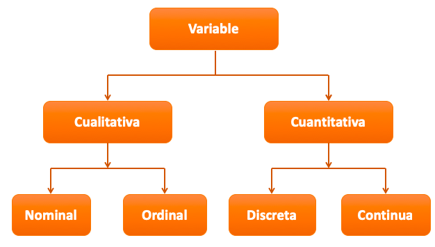
```

# **VARIABLE ALEATORIA CUANTITATIVA CONTINUA**

**Definición:** Puede tomar cualquier valor dentro de un intervalo (a,b), (a,Inf), (-Inf,b),(-Inf,Inf). Tienen una distribución normal. Las gráficas de cajas y bigotes son muy adecuadas para observar variables aleatorias continuas.

[^1]: **IQR =** **_Rango intercuantílico_** es la diferencia entre el tercer cuartil (75%) y el primer cuartil (25%) de una distribución.

```{r, echo=FALSE, out.width = '60%', fig.align='center'}

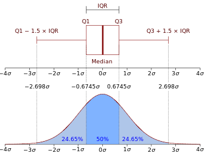
```

# **VARIABLES RELACIONADAS A EXPRESIÓN DE GENES**

- Variables relacionadas a experimentos d expresión de genes.
1. Valor de Ct o Cq.  
2. Delta Ct.  
3. Delta Delta Ct.  
4. 2^ddCT (Livak).   
5. Fold change.  
6. Log(2^ddCT). 
7. Gene expression Ratio (Pfaffl).  

# **¿CÓMO DISTRIBUYE LA VARIABLE CT?**

- [Estudio de caso](https://www.diva-portal.org/smash/record.jsf?pid=diva2%3A324414&dswid=-9651): 768 miRNAs colectados desde 19 pacientes normales y 19 enfermos de cancer a  la próstata.

```{r, echo=FALSE, out.width = '80%', fig.align='center'}

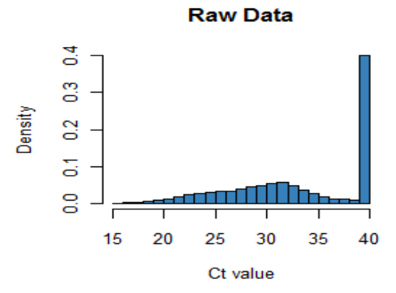
```

# **¿CÓMO DISTRIBUYE LA VARIABLE DELTA CT?**

- [Estudio de caso](https://www.mdpi.com/2073-4425/11/2/164/htm): Predicción de enfermedad coronaria con biomarcadores de miRNA.

```{r, echo=FALSE, out.width = '100%', fig.align='center'}

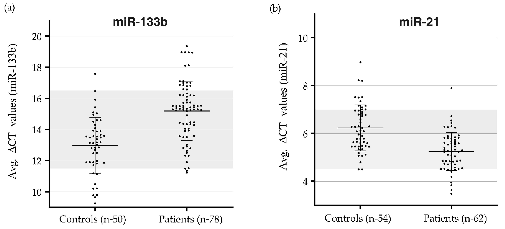
```

# **¿CÓMO DISTRIBUYE LA VARIABLE ddCT?**

- [Estudio de caso](https://journals.plos.org/plosone/article?id=10.1371/journal.pone.0007714): Modulación de la respuesta inmune en pacientes pediátricos.

```{r, echo=FALSE, out.width = '80%', fig.align='center'}

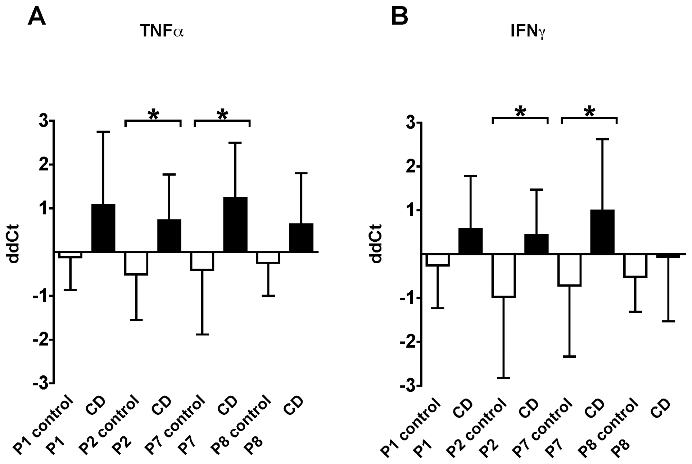
```

# **¿CÓMO DISTRIBUYE LA VARIABLE 2^ddCT?**

- [Estudio de caso](https://link.springer.com/article/10.1007/s10719-020-09917-z): regulación de Fucociltransferasa en línea celular de carcer.

```{r, echo=FALSE, out.width = '80%', fig.align='center'}

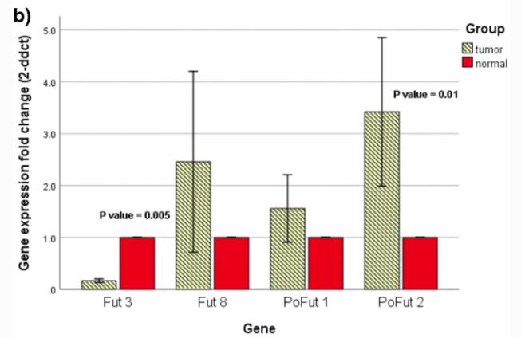
```


# **¿CÓMO DISTRIBUYE LA VARIABLE FOLD CHANGE?**

- [Estudio de caso](https://www.mdpi.com/2073-4425/11/2/164/htm): Predicción de enfermedad coronaria con biomarcadores de miRNA.

```{r, echo=FALSE, out.width = '60%', fig.align='center'}

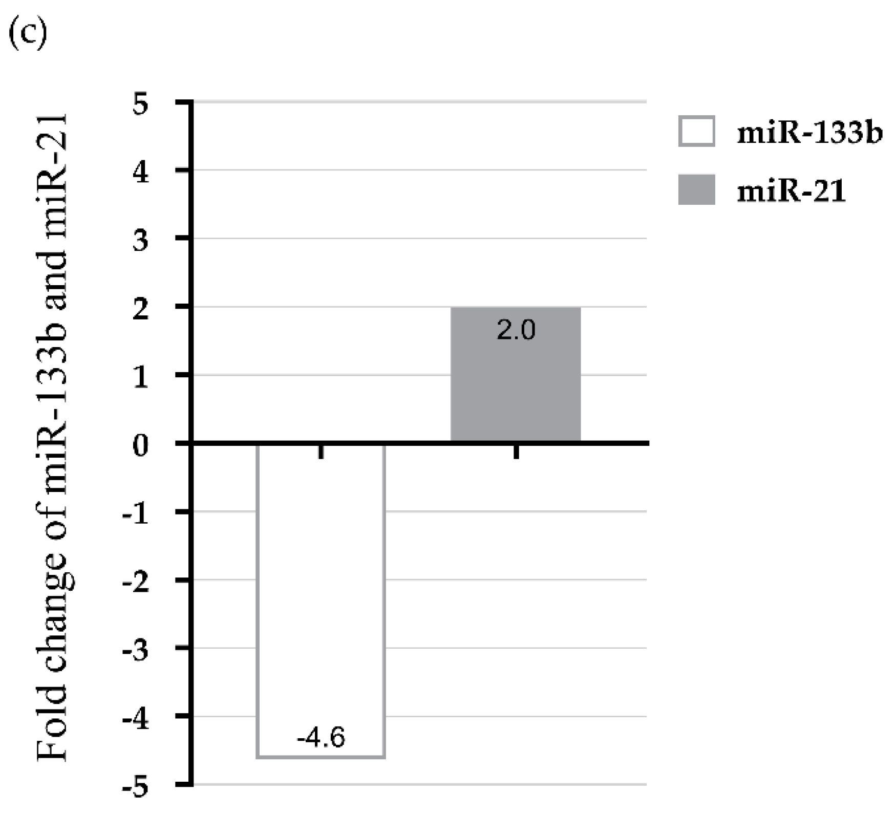
```

# **¿CÓMO DISTRIBUYE LA VARIABLE LOG(2^ddCT)?**

- [Estudio de caso](hhttps://bmcgenomics.biomedcentral.com/articles/10.1186/s12864-019-5517-4): Respuesta a la infección en soya.

```{r, echo=FALSE, out.width = '80%', fig.align='center'}

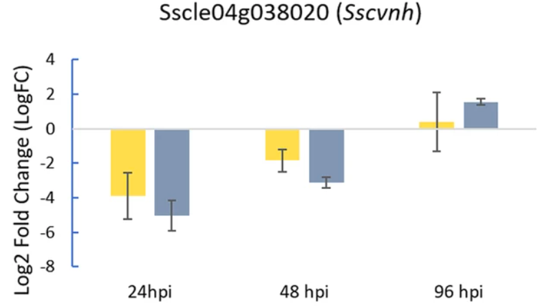
```

# **¿CÓMO DISTRIBUYE LA VARIABLE GENE EXPRESION RATIO?**

- [Estudio de caso](https://journals.plos.org/plosone/article?id=10.1371/journal.pone.0012348): Respuesta de Arabidopsis al sulfato de magnesio.

```{r, echo=FALSE, out.width = '80%', fig.align='center'}

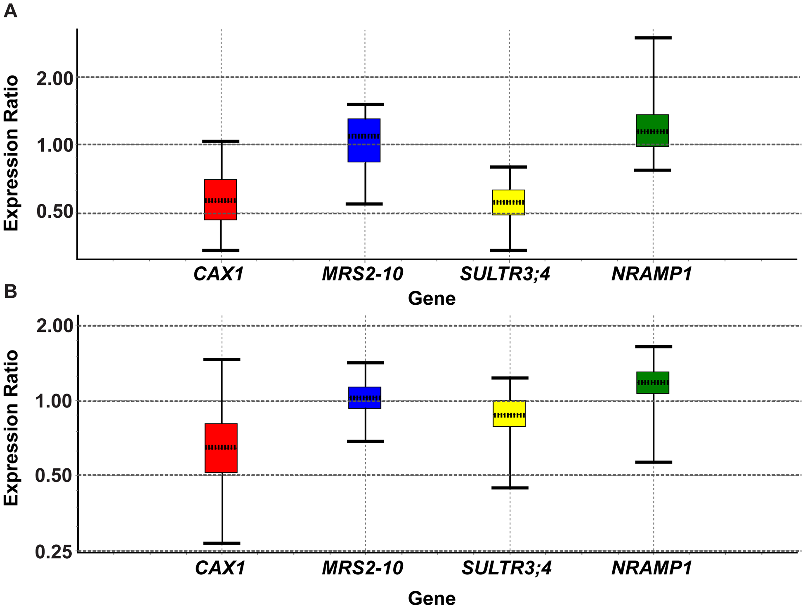
```

# **IDENTIFICA CORRECTAMENTE TU VARIABLE**

* Es importante identificar correctamente la variable de expresión de genes para evitar errores en la interpretación. 

* Mucha precaución al interpretar resultados de 2^ddCT o Expresión Ratio, pequeñas diferencias hacia abajo de 1 representan grandes cambios en la expresión relativa de los genes. 

```{r, echo=FALSE, out.width = '80%', fig.align='center'}

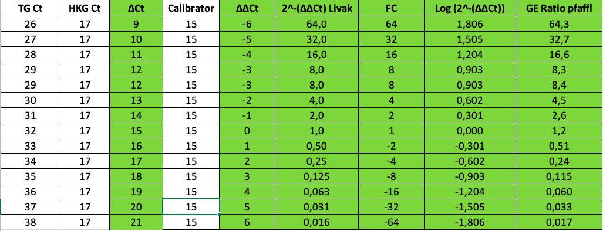
```

# CORRELACIÓN CT ENTRE REPLICAS BIOLÓGICAS

**¿Existe correlación entre réplicas biológicas?**

- [Estudio de caso](https://journals.plos.org/plosone/article?id=10.1371/journal.pone.0260902): Respuesta correlacionada entre pares de muestras (CT HK gene).

```{r, echo=FALSE, out.width = '50%', fig.align='center'}

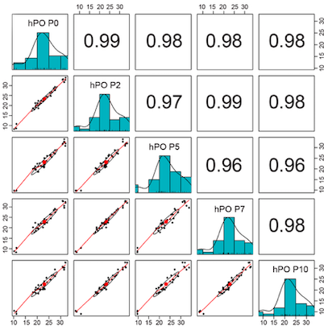
```

# CORRELACIÓN EXPRESIÓN DE GENES Y FENOTIPO

**¿Existe correlación entre expresión de mis genes y otras variables?**

- [Estudio de caso](https://link.springer.com/article/10.1007/s00429-008-0181-5): Respuesta correlacionada entre expresión de genes relacionados con esquizofrenia y edad.

```{r, echo=FALSE, out.width = '50%', fig.align='center'}

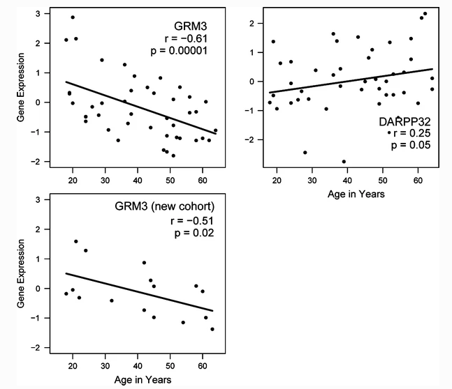
```

# OTRAS CORRELACIONES: qPCR y RNAseq

**¿Existe correlación entre expresión de genes por qPCR y RNAseq?**

- [Estudio de caso](https://bmcgenomics.biomedcentral.com/articles/10.1186/s12864-018-5318-1): Respuesta correlacionada entre RNAseq y qPCR.

```{r, echo=FALSE, out.width = '70%', fig.align='center'}

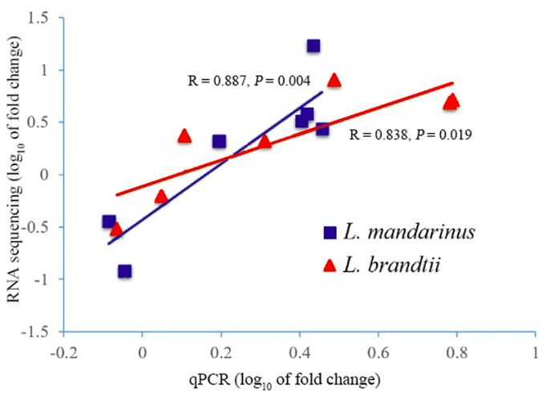
```


# COMUNICACION EFECTIVA DE TUS RESULTADOS

**Principales problemas de las barras con error**  
1. La escala del eje y.  
2. Se enmascara la variabilidad.  
3. Por lo tanto, no usar y desconfiar de ellas

```{r, out.width = '70%', fig.align='center'}
# library(xlsx)
# class(ExpresionG1)
# ExpresionG1 <- as.data.frame(ExpresionG1)
# write.xlsx(ExpresionG1, "FC_Gen1.xlsx", 
#            sheetName = "Gen1", 
#            col.names = TRUE, row.names = FALSE)

ExpresionG1 <- read_excel("FC_Gen1.xlsx") 

Resumen_G1 <- ExpresionG1 %>% group_by(Treatment) %>%
  summarize(n=n(),
            Mean_Expresion=mean(Expresion),
            sd_Expresion=sd(Expresion))

ggplot(Resumen_G1, aes(x=Treatment, y=Mean_Expresion, fill=Treatment)) + 
  geom_bar(stat="identity", color="black", position=position_dodge()) +
  geom_errorbar(aes(ymin=Mean_Expresion-sd_Expresion, ymax=Mean_Expresion+sd_Expresion), width=.2,
                position=position_dodge(.9))+
  theme(legend.position="none")+
  labs(y="Fold Change (2^ddCt)",title="Gen 1")
```


# COMUNICACION EFECTIVA: BOXPLOT

**Pros y contras del boxplot**  
1. Muestra la escala real de y.
2. Permite detectar valores atípicos.
3. No muestra el número de observaciones.

```{r, out.width = '70%'}
ggplot(ExpresionG1, aes(x=Treatment, y=Expresion, fill=Treatment))+
  geom_boxplot()+
  labs(y="Fold Change (2^ddCt)",title="Gen 1")
```

# COMUNICACION EFECTIVA: JITTER

**Pros de boxplot + jitter**  
1. Muestra la escala real de y.
2. Permite detectar valores atípicos.
3. Muestra el número de observaciones.

```{r, out.width = '70%'}
ggplot(ExpresionG1, aes(x=Treatment, y=Expresion, fill=Treatment))+
  geom_boxplot()+
  labs(y="Fold Change (2^ddCt)",title="Gen 1")+
  geom_jitter(color="#A52A2A")

```

# PAQUETE TIDYR: FUNCIONES AVANZADAS

**gather()**: Colapsa múltiples columnas para crear tidy data.
**spread()**: Separa una columna en múltiples columnas.

```{r, echo=FALSE, out.width = '90%', fig.align='center'}

knitr::include_graphics("tidy_data.png")
```

# PRÁCTICA ANÁLISIS DE DATOS

**Guía de trabajo en Rstudio.cloud**.


# RESUMEN DE LA CLASE

- Identificamos  y clasificamos variables.

- Observamos la distribución de variables relacionadas a expresión de genes.

- Identificamos la importancia de realizar un análisis exploratorio de datos en expresión de genes.

- Reconocemos preguntas importantes de un EDA: Variación y correlación.

- Realizamos gráficas con ggplot2.  
