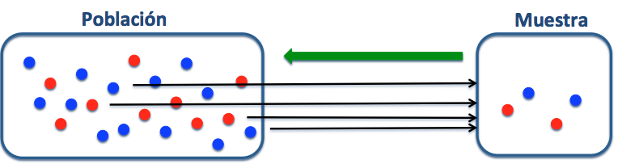
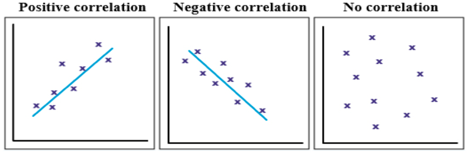
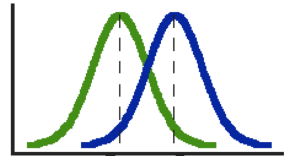
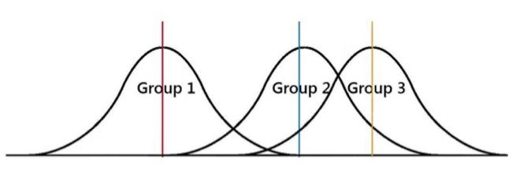
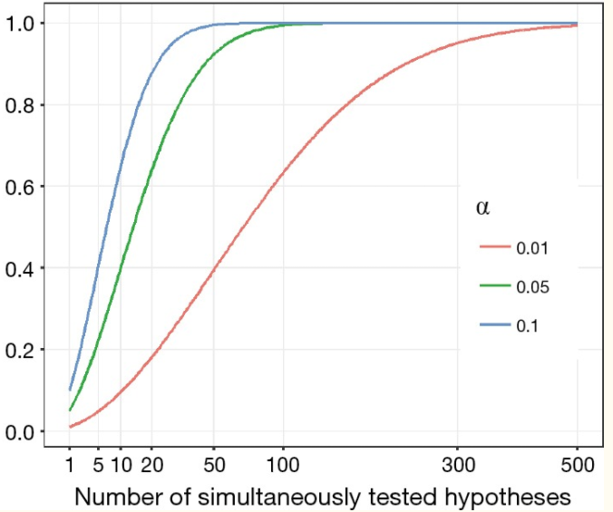
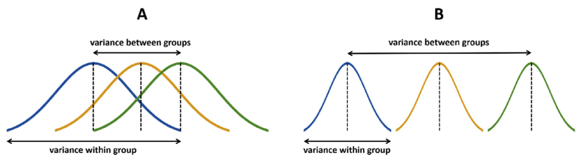
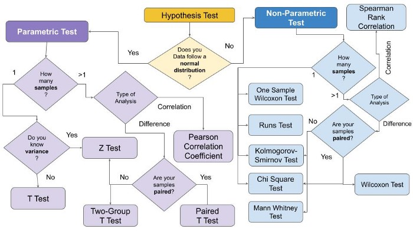

```{r setup, include=FALSE}
knitr::opts_chunk$set(echo = FALSE)
library(readxl) # Paquete para importar datos desde excel
library(ggplot2)
library(tidyr)
library(dplyr)
library(psych) # Graficas de correlación
library(knitr)
library(broom)
```

# PLAN DE LA CLASE
**1.- Introducción**
    
- ¿Qué es la inferencia estadística?.   
- ¿Cómo someter a prueba una hipótesis?
- Pruebas paramétricas: correlación, comparación de medias con 2 o más muestras independientes.
- Interpretar resultados de análisis de datos con R.

**2.- Práctica con R y Rstudio cloud**

- Someter a prueba diferentes hipótesis estadísticas.
- Realizar gráficas avanzadas con ggplot2. 

# ¿QUÉ ES LA INFERENCIA ESTADÍSTICA?

**Inferencia estadística :** Son procedimientos que permiten obtener o extraer conclusiones sobre los parámetros de una población a partir de una muestra de datos tomada de ella.

```{r, echo=FALSE, out.width = '100%' }

```

**¿Qué inferencia puede hacer de los datos de esta población?**  
**¿Qué ocurre si la muestra no es aleatoria?**

# INFERENCIA ESTADÍSTICA

**¿Par qué es importante la inferencia estadística?**  

- **Es más económico que hacer un Censo.**  
20 plantas fueron evaluadas para su respuesta al sulfato de magnesio en concentraciones similares al suelo de marte.  
  
- **Bajo ciertos supuestos permite hacer afirmaciones.**  
  El gen A se expresó más en el tejido tumoral que en el tejido normal.  
  
- **Bajo ciertos supuestos permite hacer predicciones.**  
  Nuestros resultados sugierene que el gen A y el gen B podrían ser nuevos biomarcadores para la predicción temprada de la enfermedad de la arteria coronaria. 
  
# CONCEPTOS IMPORTANTES

- **Parámetro**  
Constante que caracteriza a todos los elementos de un conjunto de datos de una población. Se representan con letras griegas.

Promedio de una población (mu) = $\mu$.
 
- **Estadístico**  
Una función de una muestra aleatoria o subconjunto de datos de una población.

Promedio de una muestra ($\bar{X}$) = $\sum$ $\frac{X_i}{n}$

# ESTIMACIÓN DE PARÁMETROS

**Objetivo: ** Hacer generalizaciones de una población a partir de una muestra.

**Tipos de estimación**    

- **Estimación puntual:** Consiste en asumir que el parámetro tiene el mismo valor que el estadístico en la muestra.  

- El valor promedio del delta CT para el gen A fue mayor en pacientes enfermos ($15.19  \pm 1.9$ ) que en pacientes sanos ($12.98 \pm 1.8$).  

- **Estimación por intervalos:** Se asigna al parámetro un conjunto de posibles valores que están comprendidos en un intervalo asociado a una cierta probabilidad de ocurrencia. 

- El valor promedio del delda delta CT es = −0.546, con un intervalo de confianza del 95% entre −0.949, −0.143.  

# PRUEBAS DE HIPÓTESIS

**Objetivo**  
Realizar una afirmación acerca del valor de un parámetro, usualmente contrastando con alguna hipótesis.

**Hipótesis estadísticas**  
*Hipótesis nula* (H~0~) es una afirmación, usualmente de igualdad. 

*Hipótesis alternativa* (H~A~) es una afirmación que se deduce de una observación previa (bibliografía) y que el investigador cree que es verdadera.

**Ejemplo**  
**H~0~**: La expresión del gen A es = en el tejido tumoral que en el tejido sano.   
**H~A~**: La expresión del gen A es > en el tejido tumoral que en el tejido sano. 

# PRUEBA DE HIPÓTESIS: UNA COLA O DOS COLAS

La hipótesis alternativa se puede plantear de tres maneras diferentes:

A) UNA COLA:  
1. El gen se expresa más en el tejido A que en el tejido B.
2. El gen se expresa menos en el tejido A que en el tejido B.
B) DOS COLAS:
2. El gen se expresa diferente (quizas más o quizás menos) en el tejido A que en el tejido B.

# ¿CUÁNDO RECHAZAR **H~0~**?

**Regla de decisión**  
Rechazo **H~0~** cuando la evidencia observada es poco probable que ocurra bajo el supuesto de que la hipótesis sea verdadera. 

Generalmente $\alpha$ = 0,05 o 0,01.

Es decir, rechazamos cuando el valor del estadístico está en el 5% inferior de la función de distribución muestral.

**Precaución en comparaciones múltiples**

Si evalúo 100 genes para el mismo tratamiento, solo por azar debemos esperar que 5 de ellos (100*0,05) estén falsamente asociados al tratamiento con probabilidad menor a 0,05. 

- Corrección de Bonferroni: Dividir  $\alpha$ por el número de repeticiones.
                   $\alpha$ corregido =  0,05 / 100 = 0,0005.
                   
# TIPOS DE PRUEBAS ESTADÍSTICAS

Según si los datos de expresión de genes cumplen algunos supuestos, las pruebas se pueden clasificar en:

1. **Métodos paramétricos**
  * La prueba de hipótesis asume una distribución normal de la variable aleatoria. Es posible transformar para cumplir el supuesto (ej. Log(FC)).  

2. **Métodos NO paramétricos**
  * La prueba de hipótesis no asume una distribución normal de la variable aleatoria.


# PRUEBA DE CORRELACIÓN

```{r, echo=FALSE, out.width = '100%',fig.align='center'}

```

# HIPÓTESIS PRUEBA DE CORRELACIÓN
**Hipótesis**  
$H_0$ : $\rho$ = 0 ausencia de correlación.      
$H_1$ : $\rho$ $\neq$ 0 existencia de correlación.    

**Supuestos:**  
	1) Las variables X e Y son continuas y su relación en lineal.     
	2) La distribución conjunta de (X,Y) es una distribución Bivariable normal.    
	
# ESTUDIO DE CASO: HK GENE EN NOGAL

[Estudio de caso](https://doi.org/10.1371/journal.pone.0209424): Correlación entre CT de 18S rRNA y GAPDH en Nogal.

```{r, echo=FALSE, out.width = '80%',fig.align='center', warning=FALSE, message=FALSE}
# Importa base de datos de CT de HK gene de Nogal en formato MESSY
nogal <- read_excel("hkg_nogal.xlsx", 
                                 col_types = c("text", "text", "numeric", 
                                 "numeric", "numeric", "numeric", 
                                  "numeric", "numeric", "numeric"))

# Correlación entre muestras
pairs.panels(nogal[3:4])
```

#  PRUEBA DE CORRELACIÓN DE PEARSON

```{r, echo=TRUE}
cor.test(nogal$`18S rRNA`, nogal$GAPDH,
         method = "pearson",
         alternative = "two.sided")
```

# PRUEBA DE COMPARACIÓN DE MEDIAS

```{r , echo=FALSE, out.width = '80%',fig.align='center'}

```


# HIPÓTESIS COMPARACIÓN DE MEDIAS
**Hipótesis**  
$H_0$ : $\mu_1$ = $\mu_2$.  
$H_1$ : $\mu_1$ $\neq$ $\mu_2$  

**Supuestos**  
1) La variable X es continua.  
2) Distribución normal.  

# ESTUDIO DE CASO: ARABIDOPSIS

[Adaptado de Yuan, et al, 2006](https://doi.org/10.1186/1471-2105-7-85). Expresión diferencial del gen MT-7 de Arabidopsis tratada con jasmonato de metilo y con alameticinam, y no tratada (control).      

```{r, warning=FALSE, message=FALSE, out.width = '80%'}
My_Theme = theme(
  plot.title = element_text(size = 18),
  axis.title.x = element_text(size = 16),
  axis.text.x = element_text(size = 16),
  axis.title.y = element_text(size = 16),
  axis.text.y = element_text(size = 16),
  legend.position = "none")

Arabidopsis <- read_excel("dat_Arabidopsis.xlsx")

ggplot(Arabidopsis, aes(x=Sample, y=ΔCt , fill=Sample))+
  geom_boxplot()+
  geom_jitter(color="#A52A2A")+
  labs(title="Delta Ct de Arabidopsis tratada y no tratada (control).", x="Sample", y="Delta Ct") +
  My_Theme

```


# PRUEBA DE T PARA DOS MUESTRAS INDEPENDIENTES

**Hipótesis**  
**$H_0$** : delta ct(tratamiento) = delta ct(control).   
**$H_1$** : delta ct(tratamiento) $\neq$ delta ct(control).  
**$H_1$** : delta delta Ct $\neq$  0.  
  
delta delta Ct (Tratamiento - control) = `r round(2.955583 - 3.640408,4)  `  

```{r, echo=TRUE}
test <- t.test(ΔCt ~ Sample, Arabidopsis,
       alternative = c("two.sided"),
       var.equal=TRUE)

```

# INTERPRETACIÓN PRUEBA DE T PARA DOS MUESTRAS INDEPENDIENTES

```{r, echo=FALSE}
test

```


# ANOVA

**¿Qué es un análisis de varianza?**

Herramienta básica para analizar el efecto de uno o más factores (cada uno con dos o más niveles) en un experimento.

```{r, echo=FALSE, out.width = '100%' }

```

# PROBLEMA DE LAS COMPARACIONES MÚLTIPLES

**¿Por qué preferir anova y no múltiples t-test?**  
Porque con una t-test normal al aumentar el número de comparaciones múltiples se incrementa la tasa de error tipo I.

```{r, echo=FALSE, out.width = '60%',fig.align='center'}

```

Fuente[1]: [1]:doi:10.21037/jtd.2017.05.34 

# ANOVA PARA COMPARAR MEDIAS

**¿Por qué se llama ANOVA si se comparan medias?**  
Por que el estadístico **F** es un cociente de varianzas.     

**F** = $\frac{\sigma^2_{entre grupos}}{\sigma^2_{dentro grupos}}$

Mientras mayor es el estadístico **F**, más es la diferencia de medias entre grupos.  

```{r, echo=FALSE, out.width = '100%' }

```

# SUPUESTOS DE UNA ANOVA

	1) Independencia de las observaciones.
&nbsp;  
	2) Normalidad.\
&nbsp;  
	3) Homocedasticidad: homogeneidad de las varianzas.\
&nbsp;  
	
# TEST POSTERIORES (PRUEBAS A POSTERIORI)

**¿Para qué sirven?**

Para identificar que pares de niveles de uno o más factores son significativamente distintos entre sí. 

**¿Cuando usarlos?**

Sólo cuando se rechaza **H~0~** del ANOVA. 

**Tukey test**  
Es uno de los más usados, similar al *t-test*, pero corrige la tasa de error por el número de comparaciones.

# ANOVA COMO UN MODELO LINEAL

**¿Qué es un modelo lineal?**  
Modelo estadístico que define una relación matemática lineal entre variables de interes.

**Modelo lineal para ANOVA de una vía**  
$y$ ~ $\mu$ + $\alpha$ + $\epsilon$   

**Modelo lineal para ANOVA de dos vías**  
$y$ ~ $\mu$ + $\alpha$ + $\beta$ + $\epsilon$     

**Modelo lineal para ANOVA de dos vías con interacción**  
$y$ ~ $\mu$ + $\alpha$ + $\beta$ + $\alpha$*$\beta$ + $\epsilon$

# HIPÓTESIS EN UNA ANOVA

**Hipótesis factor 1**  
**H~0~** : $\alpha_{1.1}$ = $\alpha_{1.2}$ = $\alpha_{1.3}$ 

**Hipótesis factor 2**  
**H~0~** : $\beta_{2.1}$ = $\beta_{2.2}$ = $\beta_{2.3}$  

**Hipótesis interacción**  
**H~0~** : $\alpha$*$\beta$ = 0

**Hipótesis Alternativa**  
**H~A~** : No todas las medias son iguales

# ESTUDIO DE CASO: HPS70

[Adaptado de Xu, et al, 2018](https://www.mdpi.com/2073-4425/9/12/590). Expresión diferencial del gen hps-70 en peces expuestos a tratamiento de frío o calor.  

```{r, warning=FALSE, message=FALSE, out.width = '80%'}

dat_hps70 <- read_excel("dat_hps70.xlsx")

ggplot(dat_hps70, aes(x=Treatment, y=deltaCt , fill=Treatment))+
  geom_boxplot()+
  geom_jitter(color="#A52A2A")+
  labs(title="Boxplot delta Ct peces expuestos a estres por calor o frío.", x="Treatment", y="delta Ct")+
  My_Theme

```

# PRUEBA DE ANOVA

**$H_0$** : delta ct(hot) = delta ct(cold) = delta ct(control).   
**$H_1$** : No todas las medias son iguales.  

```{r, echo=TRUE}
res.aov <- lm(deltaCt ~ Treatment, data = dat_hps70)
anova(res.aov)
```


# COMPARACIONES MÚLTIPLES

```{r , echo=TRUE}
fit_anova <- aov(res.aov)
tk <- TukeyHSD(fit_anova)
```

```{r}
tidy(tk) %>% kable(caption = "Prueba de Tukey.", digits=2,
col.names=c("Trat.","Contraste", "H0",
            "Dif.", "IC-bajo","IC-alto",
            "p-ajus"))
```

# RECOMENDACIONES FINALES

1. Demuestre que la eficiencia de amplificación es la misma para su gen de interes y su gen de referencia. 

2. Use el valor de Ct como la principal variable aleatoria para explorar y someter a prueba su hipótesis: Delta Delta Ct = 0. 

3. La práctica de someter a prueba una hipótesis de comparación de medias usando el 2-delta delta Ct o el Gene Expression Ratio no es recomendada (Tranforme a log).

4. Visualice sus datos de Delta Ct (tratamiento y control), luego realice la prueba estadística (H0 = delta delta Ct = 0) y finalmente interprete y muestre la expresión diferencial usando 2-Delta Delta Ct, Fold change o Gene Expression Ratio.

Fuente: [Yuan et al. 2006](https://doi.org/10.1186/1471-2105-7-85), [Schmittgen & Livak. 2008](https://www.nature.com/articles/nprot.2008.73), [Ahmed and Kim. 2018](https://peerj.com/articles/4473/)

# PRÁCTICA ANÁLISIS DE DATOS

```{r, echo=FALSE, out.width = '100%',fig.align='center'}

```

# RESUMEN DE LA CLASE

1. **Conceptos básicos de inferencia estadística**  
    * Estadístico y parámetro.\
&nbsp;    
    
2. **Conceptos básicos de pruebas de hipótesis**  
    * Hipótesis nula, alternativa.\
&nbsp;      
  
3. **Realizar pruebas de hipótesis**
    * Test de correlación.  
    * Test de comparación de medias para 2 muestras independientes.
    * Anova

4. **Realizar gráficas avanzadas con ggplot2**.    
