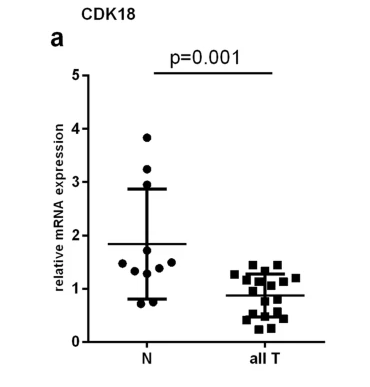

```{r setup, include=FALSE}
knitr::opts_chunk$set(echo = FALSE)
library(ggplot2)
library(tidyr)
library(dplyr)
library(FSA) #perform Dunn's Test with Bonferroni correction for p-values
library(pander) # da formato a tablas estadisticas

```

# PLAN DE LA CLASE
**1.- Introducción**
    
- ¿Qué son las pruebas no paramétricas?.
- Test de Correlación no paramétrico.
- Pruebas de contraste no paramétrico.
- Prueba de asociación Chi cuadrado.

**2.- Práctica con R y Rstudio cloud**

- Realizar pruebas no paramétricas.  
- Realizar gráficas avanzadas con ggplot2. 

# MÉTODOS NO PARAMÉTRICOS

- Conjunto diverso de pruebas estadísticas.

- El concepto de “no paramétrico” a veces es confuso, pues los métodos no paramétricos si estiman y someten a prueban hipótesis usando parámetros, pero no los de distribución normal.

- Se aplican usualmente cuando hay pocas réplica biológicas, cuando la variables aleatoria (ej. FC o delta ct) no cumple con el supuesto de normalidad.

- El concepto matemático de permutación está subyacente a muchos métodos no paramétricos y se utiliza para someter a prueba las hipótesis.

# SUPUESTOS DE LOS MÉTODOS NO PARAMÉTRICOS

- Las variables son independientes.

- Muestras independientes con idéntica distribución.

- No tienen supuestos acerca de la distribución de la variable (algunas asumen chi-cuadrado).

- La distribución del estadístico se estima muy a menudo por permutación.

# PRUEBA DE CORRELACIÓN NO PARAMÉTRICA: SPEARMAN

**¿Para que sirve?**    
  
Para estudiar asociación de dos variables, cuando no se cumple uno o varios supuestos de la correlación paramétrica: 

- Las variables X e Y no son continuas.  
- No existe relación lineal.  
- La distribución conjunta de (X, Y) no es una distribución Bivariable normal.  


# ESTUDIO DE CASO: CORRELACIÓN COPIAS Y EXPRESIÓN GEN DEFENSINA

[Schmitt et al. 2013](https://journals.plos.org/plosone/article?id=10.1371/journal.pone.0075900): Relación lineal entre número de copias del gen y su expresión.

**¿Cuál es el supuesto que no se cumple?**  

```{r, out.width = '70%' }

```

# PRUEBA DE HIPÓTESIS CORRELACIÓN DE SPEARMAN 


```{r}
# Crea objetos X (Nº copias gen) e Y (Expresión relativa) 
gene_number <- c(13,25,34,46,44,36)
expression <- c(0.5,0.2,1.4,2.4,1.7,0.8)
```

```{r, echo=TRUE}

# Realiza test de correlación
cor.test(gene_number,expression, method = "spearman",
         alternative = "two.sided") %>% pander()

```

# PRUEBA DE MANN-WHITNEY (W): COMPARACIÓN 2 MUESTRAS INDEPENDIENTES

**¿Para qué sirve?**   
Para comparar dos muestras con idéntica distribución, con diferentes medianas y sin normalidad.

```{r, echo=FALSE, out.width = '70%' }
knitr::include_graphics("No_par.png")
```

# ESTUDIO DE CASO: EXPRESIÓN CDK18 EN SANGRE

[Simonovic eyt al. 2020](https://doi.org/10.1186/s12894-019-0542-9): Comparación de expresión relativa de CDK18 en sangre de pacientes sanos (N) y con tumor (T) renal. 

```{r, out.width = '50%' }

```

# PRUEBA DE HIPÓTESIS DE MANN-WHITNEY

```{r}
# Crea objetos tratamiento y control
normal <- c(0.8,0.9, 1.5,1.6,1.6,1.7,1.7,1.9,3.0,3.2,3.9)
tumoral <- c(0.4,0.4,0.5,0.6,0.6,0.8,0.8,1.0,1.3,1.3,1.4,1.4,1.5,1.6)
```


```{r, echo=TRUE, message=FALSE, warning=FALSE}

# Realiza prueba de Mann-Whitney
wilcox.test(normal, tumoral, alternative = "two.sided",
            paired = FALSE) %>% pander()
```


# PRUEBA DE WILCOXON MUESTRAS PAREADAS

**¿Para que sirve?**   
Para comparar dos muestras *pareadas* con idéntica distribución, con diferentes medianas y sin normalidad.

```{r, echo=FALSE, out.width = '90%' }
knitr::include_graphics("pareadas.png")
```

# ESTUDIO DE CASO: BIOMARCADOR PARA TERAPIA DE CANCER COLORRECTAL

 [**Li et al. 2018**](https://doi.org/10.2147/OTT.S163883). Expresion del gen SPINT1-AS1 (A) y SPINT1 (B) en 45 pares de muestras pre y post-operados de cancer colorrectal.

```{r, echo=FALSE, out.width = '100%' }

```

# PRUEBA DE HIPÓTESIS DE WILCOXON

```{r}
# Crea objetos pre y post
data <- data.frame(Tratamiento = rep(c("pre", "post"), each = 10),
                   FC = c(runif(10, 0.5, 6),
                            runif(10, 0.1, 1.9)))
```


```{r, echo=TRUE}
# Realiza prueba de Wilcoxon
wilcox.test(FC ~ Tratamiento, data = data,
            alternative = "two.sided",
            paired = TRUE) %>% pander()
```

# PRUEBA DE KRUSKAL - WALLIS: COMPARACIÓN MÚLTIPLES MUESTRAS INDEPENDIENTES

**¿Para que sirve?**   
Para comparar múltiples muestras con idéntica distribución, con diferentes medianas y sin normalidad.

```{r, echo=FALSE, out.width = '90%' }
knitr::include_graphics("multiple.png")
```


# ESTUDIO DE CASO: EXPRESIÓN SLC6A14 EN RESPUESTA A ISQUEMIA.

 [**Lange et al. 2015**](doi:10.1371/journal.pone.0133987.g002). Respuesta a isquemia en tejido normal (N) y tumoral (T) sometido a isquemia por 0, 10, 20 y 45 min.

```{r, echo=FALSE, out.width = '90%' }

```


# PRUEBA DE KRUSKAL - WALLIS CON R

```{r}
# Simula datos
N0 <- c(1,2,3,4,5,6,7,8,9,10,20,30,40,50,60,70,80,90,100,110) # 0 min
N10 <- c(0.1,0.2,0.3,0.4,0.5,0.6,0.7,0.8,0.9,1,1.1,1.2,1.3,1.4,1.5,1.6,1.7,1.8,1.9,2) # 10 min 
N20 <- c(0.3,0.4,0.5,0.6,0.7,0.8,0.9,1,1.1,1.2,1.3,1.4,1.5,1.6,1.7,1.8,1.9,2,2.1,2.3) # 20 min
N45 <- c(0.2,0.3,0.4,0.5,0.6,0.7,0.8,0.9,1,1.1,1.2,1.3,1.4,1.5,1.6,1.7,1.8,1.9,2,2.2) # 45 min
```


```{r, echo=TRUE}
# Realiza prieba de kruskal
kruskal.test(list(N0, N10, N20, N45)) %>% pander()

```


# PRUEBA DE DUNN PARA COMPARACIONES MULTIPLES

```{r, echo=FALSE}
# ordena datos en formato tidy
data <- data.frame(N0, N10, N20, N45)
tidy <- data %>% gather("Time","FC", 1:4)
```


```{r, echo=TRUE, message=FALSE, warning=FALSE}
# Realice prueba de dunn
dunnTest(FC ~ Time,
         data=tidy,
         method="bonferroni")
```

# PRUEBA DE CHI CUADRADO: ASOCIACIÓN CON VARIABLES CATEGÓRICAS

**¿Para que sirve?**  
Se utilizan para investigar la asociación de dos o más variables categóricas una de las cuales es una variable respuesta y la otra es una variable predictora.

|  **Tratamiento** | **Respuesta +**| **Respuesta -** | 
|:----|:---|:---|
| Si | a | c | 
| No | b | d | 

# ESTUDIO DE CASO: PREDICCIÓN MOLECULAR DE EMBRIONES ANEUPLOIDES

[**Lal et al. 2022**](https://doi.org/10.1007/s10815-022-02510-3). Expresión del gen BCL2L13 en embiones euploides y anauploides.

```{r, echo=FALSE, out.width = '100%' }

```

# PRUEBA CHI CUADRADO

```{r, echo=FALSE}
# Crea matriz de datos
datos <- c(9, 1, 2, 7)
dim(datos) <- c(2,2)
rownames(datos) <- c('Euploides','Aneuploides')
colnames(datos) <- c('Expresado','No expresado')
```

```{r, echo=TRUE,warning=FALSE}
datos
# Test de Chi-squared en R (chisq.test)
test<-chisq.test(datos, correct = FALSE)

test %>% pander()
```

# PRÁCTICA ANÁLISIS DE DATOS

- Guía de trabajo práctico disponible en Rstudio.cloud.  

```{r, echo=FALSE, out.width = '80%' }

```

[FUENTE: Corporate finance institute](https://corporatefinanceinstitute.com/resources/knowledge/other/nonparametric-tests/)

# RESUMEN DE LA CLASE

Revisión de conceptos y práctica de estadística no paramétrica.  

-  Correlación de Spearman.  
-  Prueba de Man-Whitney.    
-  Prueba de Wilcoxon.  
-  Prueba de Kruskal Wallis + DUNN test. 
-  Prueba de Chi-cuadrado.  
