```{r setup, include=FALSE}
knitr::opts_chunk$set(echo = FALSE)
library(readxl)
library(ggplot2)
library(dplyr)
library(knitr)
library(psych) # Graficas de correlación
library(factoextra) # Visualiza PCA
library(vegan) # Elabora PERMANOVA

```

# PLAN DE LA CLASE

**1.- Introducción**
    
- ¿Qué son los análisis multivariantes?.
- Estudio de caso: Biomarcadores de genotoxicidad.
- Etapas para realizar análisis multivariante.
- Matriz de distancia euclideana y análisis de cluster jerárquico.
- Análisis de componentes principales.
- PERMANOVA

**2). Práctica con R y Rstudio cloud.**

- Elaborar análisis multivariante con R.

# INTRODUCCIÓN ANÁLISIS MULTIVARIANTE

**¿Qué son los análisis multivariantes?**   
Conjunto diverso de métodos estadísticos que observan y estudian el comportamiento simultáneo de múltiples variables.

```{r, echo=FALSE, out.width = '70%' }
rm(list = ls())
Ct_dat <- read_excel("PCA_dat.xlsx", sheet = "Ct_raw")
Ct_mat <- as.matrix(Ct_dat[,-1])
row.names(Ct_mat) <- Ct_dat$ID_REF
hkg <- t(Ct_mat)
hkg <- hkg[,4:8]
kable(head(hkg), caption = "Ejemplo de Ct para multiples genes y muestras.", digits = 1)
```

# TIPOS DE MÉTODOS MULTIVARIANTES

```{r, echo=FALSE, out.width = '100%' }
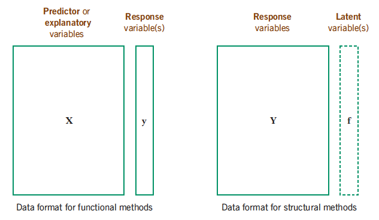
```

Fuente: [Multivariate Statistic, 2014](https://www.fbbva.es/microsite/multivariate-statistics/legal.html)

# MÉTODOS MULTIVARIANTES SEGÚN TIPO DE VARIABLE

```{r, echo=FALSE, out.width = '110%' }
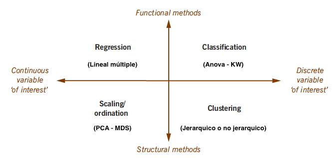
```

Fuente: [Multivariate Statistic, 2014](https://www.fbbva.es/microsite/multivariate-statistics/legal.html)


# ESTUDIO DE CASO: BIOMARCADORES DE GENOTOXICIDAD.

[Cho et al. 2018](https://doi.org/10.1002/em.22257): Validación de un panel de expresión de genes como biomarcadores de genotoxicidad en modelo *in vitro*.

- Objetivo: Reducir el uso de animales en estudios de genotixicidad.
- Células TK6 se exponen a 14 agentes que inducen daños en el ADN (DDI) y a 14 agentes que no indicen daño (non-DDI) por 4 h.

|  **Tipo de agente** | **Ejemplos**   |
|:---:|:---:|
| DDI  | Gamma irradiation; Cadmium chloride; Potassium chromate; Hydrogen peroxide |
| non-DDI  | Colchicine; Heat shock (47°C); Ethanol; Glycolysis inhibitor  |

# ESTUDIO DE CASO: MAPA DE CALOR LOG10(FOLD CHANGE)

- 61 genes fueron evaluados (DDI:inductor de daño en el ADN; Non-DDI.  
```{r, out.width='90%'}
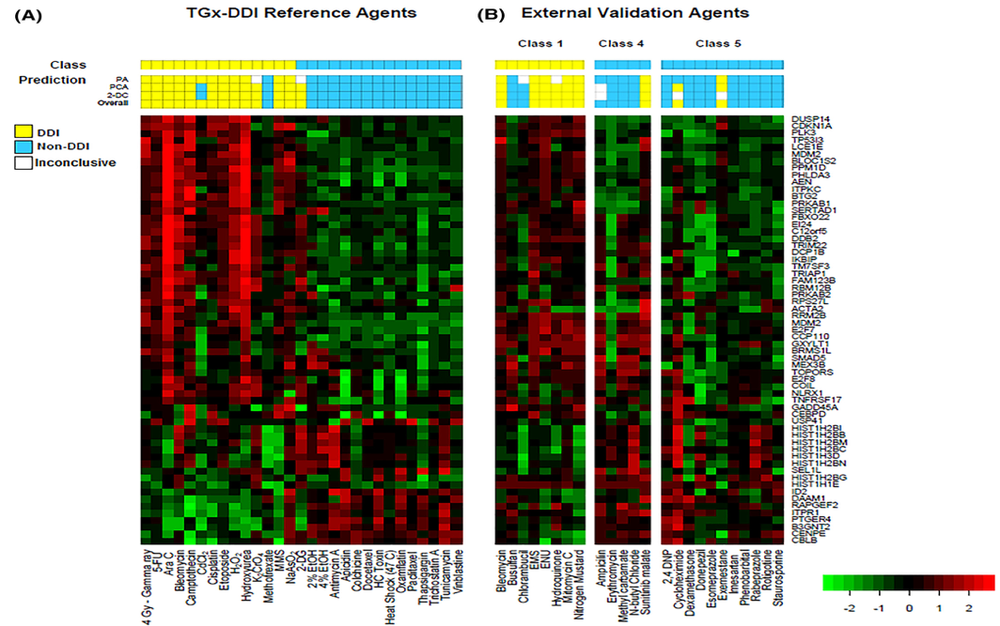
```

# ESTUDIO DE CASO: ACP

**PCA** permite clasificar agentes (DDI o non DDI) en función de la expresión global de genes (excepciones: 2-DG, Cdcl2 y Methotrexate).

```{r, out.width='50%'}
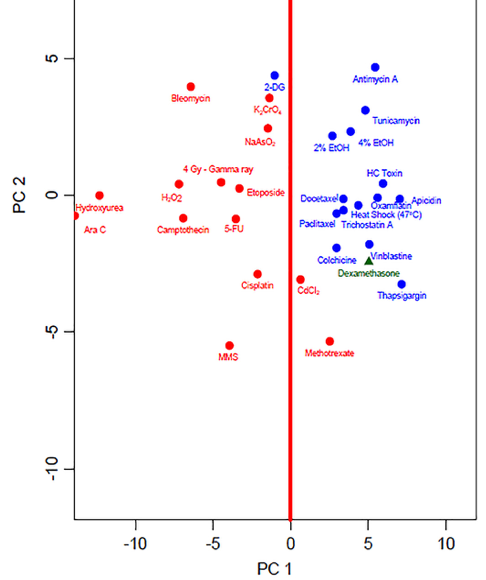
```

# ESTUDIO DE CASO: CLUSTER JERÁRQUICO

**Cluster jerárquico** permite construir grupos jerarquicos por similitud de expresión de genes (excepciones: 2-DG, Cdcl2 y Methotrexate).

```{r, out.width='100%'}
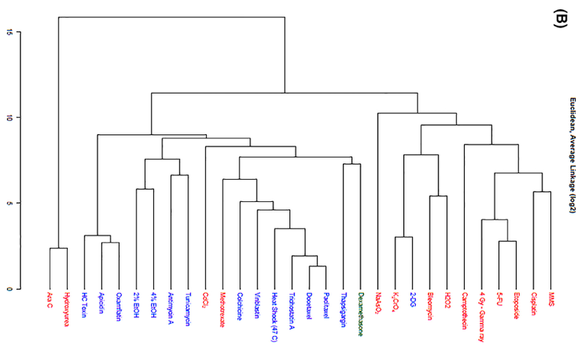
```

# ANÁLISIS MULTIVARIANTE PARA ESTUDIO DE CASO

1) Explorar correlación de expresión de genes (Ct o FC). Si no están correlacionadas el PCA no es de utilidad.  
2) Explorar matriz de distancia (euclideana) con log(FC).  
3) Elaborar e interpretar Cluster jerárquico.  
4) Elaborar e interpretar PCA.
5) Elaborar e interpretar PERMANOVA.


# FC Y GENOTOXICIDAD

```{r, out.width = '90%'}
FC_dat <- read_excel("PCA_dat.xlsx", sheet = "Fold_Change")
FC_mat <- as.matrix(FC_dat)
row.names(FC_mat) <- FC_dat$ID_REF
FC_mat <- FC_mat[,-1]
hkg <- t(FC_mat)
hkg <- hkg[,1:5]
class(hkg) <- "numeric"
kable(head(hkg), caption = "FC multiples genes y muestras.", digits=2)

```

# CORRELACIÓN FC: 7 GENES

```{r, out.width = '90%'}
FC_dat <- read_excel("PCA_dat.xlsx", sheet = "Fold_Change")
FC_mat <- as.matrix(FC_dat[,-1])
row.names(FC_mat) <- FC_dat$ID_REF
gene <- t(FC_mat)
pairs.panels(gene[,1:7], method = "spearman")

```

# MATRIZ DE DISTANCIA O SIMILARIDAD

**¿Qué es y para que sirven?**  
- Las matrices de distancia o similaridad están en la base de todos los análisis multivariados. 

**Algunas consideraciones**  
- Las matrices de distancia se pueden elaborar tanto para variables cuantitativas continuas, como discretas.

- Debido a que las variables pueden tener diferente escala o magnitud es necesario muchas veces transformar o estandarizar las variables antes de calcular las matrices de distancia.

# TIPOS DE MATRICES DE DISTANCIA 

- **Euclideana**: Para variables cuantitativas continuas.  
  Con base en el teorema de pitágoras  
  $c^2= a^2 +b^2$  
  $a= \sqrt{c^2-b^2}$  
  $b= \sqrt{c^2-a^2}$  
  $c= \sqrt{c^2+b^2}$  

- **No euclideana**: Para variables cuantitativas discretas.  
 a) Bray-Curtis (datos de conteo).  
 b) Jacard (binarias)
 
# MATRIZ DE DISTANCIA EUCLIDEANA ENTRE MUESTRAS

```{r}
dist_euclidea <- dist(log(gene))
# class(dist_euclidea)
# extracto de matriz de distancia
dist_euclidea <- as.matrix(dist_euclidea)
# class(dist_euclidea)
dist_euclidea[c(1:8),c(1:4)]
```


# CLUSTER JERARQUIDO

```{r, out.width = '105%'}
dist_euclidea <- dist(log(gene))
fit <- hclust(dist_euclidea, method="average")
plot(fit, hang=-1)
rect.hclust(fit, k = 3, border = c(2,2,4))

```

# COMPONENTES PRINCIPALES

- ¿Qué son los componentes principales (PC)?  
Combinación lineal de las variables originales no correlacionadas entre si (perpendiculares / ortogonales).
- Permite reducir la dimensionalidad de un conjunto de datos con muchas variables respuesta, sin perder mucha información

```{r, echo=FALSE, out.width = '80%' }
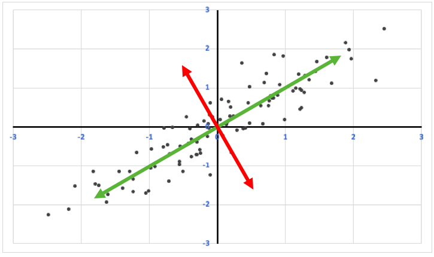
```

# COMPONENTES PRINCIPALES: COMO SE CALCULAN

- Cada componente principal se obtiene por combinación lineal de las variables originales (FC).
```{r, echo=FALSE, out.width = '100%' }
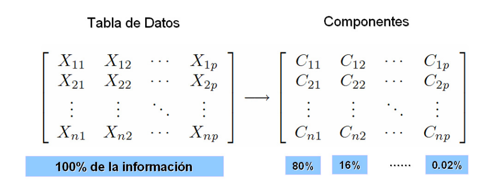
```

Fuente: [Rodriguez, 2009](http://www.oldemarrodriguez.com/yahoo_site_admin/assets/docs/cap2.143111051.pdf)

# PCA: COMPONENTES PRINCIPALES

- Extracto matrix CP (eigenvector).
```{r}
FC_pca <- prcomp(log(gene), scale = TRUE)
FC_pca[["rotation"]][1:8,1:3]
```

# VARIANZA EXPLICADA

Cada eigenvalue estima la varianza explicada por cada CP. Note que en este ejemplo los primeros dos componentes principales pueden capturar mucha de la varianza explicada por todas las variables analizadas. 

```{r, echo=FALSE, out.width = '80%' }
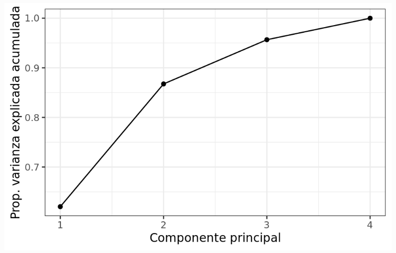
```

# PCA: VARIANZA EXPLICADA

```{r}
My_Theme = theme(
  plot.title = element_text(size = 16),
  axis.title.x = element_text(size = 14),
  axis.text.x = element_text(size = 14),
  axis.title.y = element_text(size = 14),
  axis.text.y = element_text(size = 14),
  legend.position = "none")

p <- fviz_eig(FC_pca, addlabels=TRUE)+
  ylim(0, 60)

p + My_Theme
  
```

# GRÁFICAS BI-PLOT

- 2 eigenvector o componentes principales para cada variable.
- Correlación de expresión de genes + observaciones (Color naranjo y verde = tipos de celulas).

```{r, echo=FALSE, out.width = '50%' }
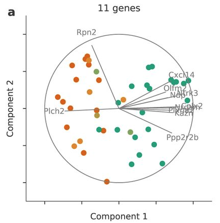
```

Fuente: [Kovak, et al. 2018](https://www.biorxiv.org/content/10.1101/302208v1.full)

# PCA: GRÁFICA POR MUESTRA

```{r, out.width = '100%', message=FALSE}
FC_factor <- read_excel("PCA_dat.xlsx", sheet = "Tratamiento_FC")

q <- fviz_pca_ind(FC_pca, repel = TRUE,
             label = "none",
             habillage = FC_factor$Treatment,
             addEllipses = FALSE, pointsize = 3) # añade elipses para identificar factores de clasificación y aumenta tamaño simbolos

q + My_Theme

```

# PCA: GRÁFICA POR VARIABLE
```{r, out.width = '70%'}
# fviz_pca_var(FC_pca)
fviz_pca_var(FC_pca, select.var=list(name = c("DAAM1","USP41","HIST1H2BI","HIST1H2BM","HIST1H1E","CEBPD", "RAPGEF2","TRIAP1","PRKAB2")))
```

# PCA: GRÁFICAS BI-PLOT

```{r, out.width = '100%'}
r <- fviz_pca_biplot(FC_pca,
                repel = TRUE,
                label = "var",
                habillage = FC_factor$Treatment,
                addEllipses = TRUE,
                ellipse.level=0.60,
                pointsize = 3,
                select.var=list(name = c("DAAM1","USP41","HIST1H2BI","HIST1H2BM","HIST1H1E","CEBPD", "RAPGEF2","TRIAP1","PRKAB2")))

r + My_Theme
```


# ANÁLISIS DE VARIANZA MULTIVARIANTE PERMUTACIONAL

- **¿Qué es un PERMANOVA?**   
a) Es una prueba estadística multivariante No paramétrica.\
&nbsp;
b) Determina, en términos simples, si el centroides de un conjunto de observacione difiere del centróide de otro grupo.

```{r, echo=FALSE, out.width = '60%' }
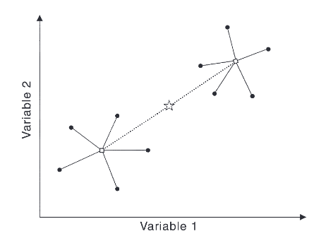
```

[Fuente: Anderson, 2001](https://doi.org/10.1111/j.1442-9993.2001.01070.pp.x)

# HIPÓTESIS PERMANOVA

- Hipótesis.
a) $H_0$= No existe diferencia entre los grupos.
b) $H_1$= Al menos dos grupos son diferentes.

- Datos: matriz de distancia.

```{r, echo=FALSE, out.width = '60%' }
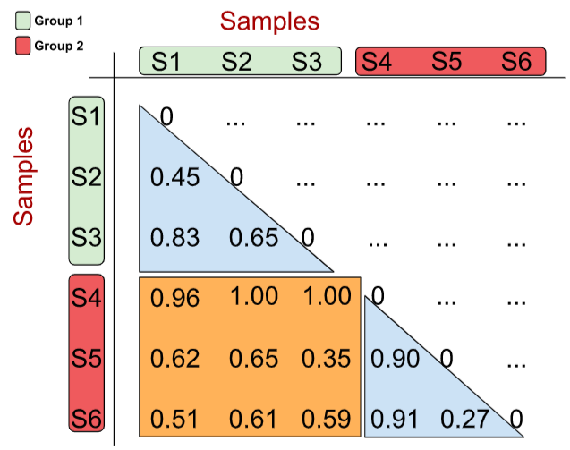
```

# PERMANOVA DATOS GENOTOXICIDAD

```{r}
FC_dat <- read_excel("PCA_dat.xlsx", sheet = "Fold_Change")
# Transformar a matriz
FC_mat <- as.matrix(FC_dat)
row.names(FC_mat) <- FC_dat$ID_REF
FC_mat <- FC_mat[,-1]
FCt <- t(FC_mat)
class(FCt) <- "numeric"
```


```{r, message=FALSE}
permanova <- adonis(FCt ~ Treatment, method = "bray", data=FC_factor, permutations=999)
permanova[["aov.tab"]]
```


# RESUMEN DE LA CLASE

- ¿Qué son los análisis multivariados?.\
&nbsp;
- ¿Qué es un análisis de componentes principales?.\
&nbsp;
- ¿Qué son los componentes principales?.\
&nbsp;
- Etapas para realizar un ACP.\
&nbsp;
- Varianza explicada.\
&nbsp;
- Graficas biplot.